## この記事の概要

この記事では，レポートを作成する学生向けに，長い数式の記入やグラフの作成をパソコンで手軽に効率よく行う方法を紹介します．

具体的に取り上げる内容は，

1. 数式の記入方法
1. グラフの作成方法
1. 紙媒体のメモなどを電子媒体に変換する方法

の三つです．

以下ではまず，WordやExcelなどのほとんどの人が利用経験のあるソフトでの数式の記入法やグラフの作成法について触れた後，オンラインツールの簡単な使い方ならびに長所や短所について説明します．最後にそれぞれのツールの長所，短所についてまとめます．

## レポート作成のためのツールの便利な使い方

### 数式の記入方法

#### 1．Word

ここでは，Microsoft Wordを用いた基本的な数式の記入方法について紹介します．（この記事ではWindows10，Word 2016で動作を確認しています．）

基本的な数式の記入方法には，数式タブをクリックして数字や文字を打ち込む方法，文字をキーボードから手打ちしていく方法，スクリーン上で手書きすることで数式を出力する方法があります．

##### 数式を打ち込む方法

まず，数字や文字を選択して打ち込む方法について説明します．Microsoft Wordの［挿入］タブを選択し，リボン右端にある（下図参照）［数式］をクリックします．

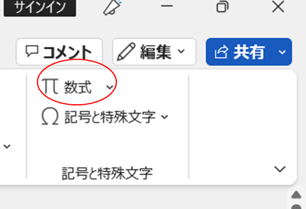{:height="200px"}

クリックすると数式タブが出てきます．（「Alt」+「Shift」+「=」キーの同時押しでも数式タブを呼び出すことが可能です．） 数式タブ内のそれぞれの項目を選択していくことで，作成したい数式を記述することができます．しかしながら，文字を一つ一つ選択する必要があるため，複雑で多くの文字を使うような数式を作成したい場合，かなりの手間と時間がかかってしまいます．

次に，キーボードから手打ちで数式を記入する方法について説明します．この方法は数式タブ内にコードを打ち込むことで記入ができます．

一例を示します．下図のように「\打ちたい文字の綴り」を打ち込んでいきます．

打ち込みが終了したら「Enter」を押すと表示したい数式に変換されます．また，チートシートは[こちらのホームページ](https://sites.google.com/site/bknobiboroku/windows/word_equation_editor_shortcuts)が参考になります．

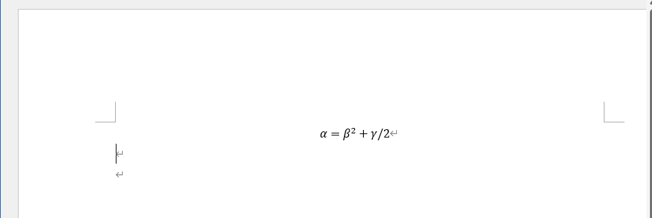

##### 手書きで数式を記入する方法

次に，手書きで数式を記入する方法について説明します．

［描画］タブを選択し，さらに［インクを数式に変換］を選択すると，下図のような画面が出てきます．（［挿入タブ］の数式の選択画面からも［インクを数式に変換］が表示されます．）

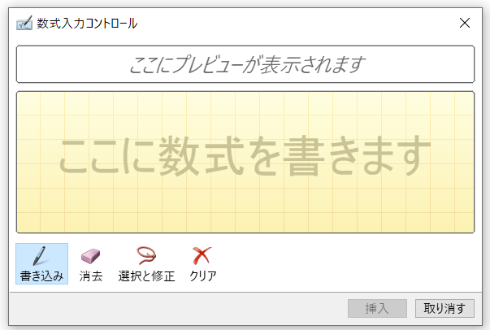{:height="400px"}

数式を手書きで書き込むと下図のように読み取ってくれます．

{:height="400px"}

このように，文字や記号を一つ一つ選択する手間をかけずに，数式を記入することができます．また，上の画像のようにマウスで書いたような非常に読みにくい文字でも読み取ることが可能です．しかしながら，一部の特殊文字や連立した式の出力はできないことが欠点です．

#### 2．Mathpix

Wordよりも簡単に数式を作成できるソフトとして，ここでは[Mathpix](https://mathpix.com)を取り上げます．

Mathpixを用いるにはソフトをダウンロードする必要があります．

インストール方法：[Mathpix](https://mathpix.com)のホームページに飛び，［Downloads］タブからMacかWindowsか等の環境にあうソフトをダウンロードできます．

**主な使用方法**

パソコンのスクリーン上の数式をsnippingする（切り取る）ことにより数式を読み取る方法と，Mathpix内の画面上で手書きで記入した数式を読み取る方法があります．

Mathpixをダウンロードしたら，下図左上のアイコンから使用したい読み取り方法に応じて選択していきます．

パソコンのスクリーン上の数式を読み取りたい場合は，一番左のアイコンをクリックすると，snipping画面が出てきます．スクリーン上の該当部分をsnipすることで，数式のインプットをします．

インプットを行うと，下図のような画面になります．

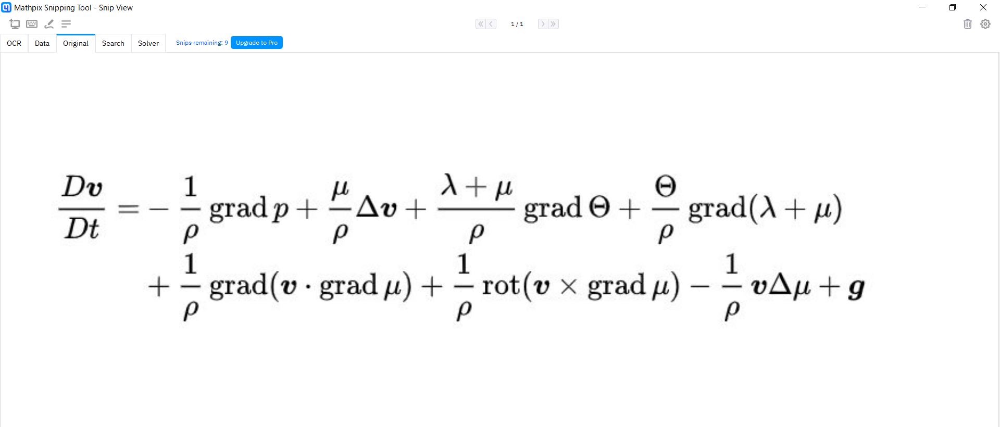

表示されている数式はスクリーン上から読み取った数式です．この画面から「Export.docx」や「Copy.PNG」を選択することで，Wordに変換したり，pngファイルとして出力したりすることができます．

Googleドキュメントでも下図のように適当な大きさで貼り付けができます．

この方法を用いれば，PC上に表示している資料の数式の読み取りも可能になるほか，ノートに記入した数式や教科書に記載されている数式などを写真撮影し，画像ファイルをスクリーン上に表示することですぐにWordファイルに変換できます．

snippingについてのさらなる情報は，Mathpixの提供する[こちらのサイト](https://mathpix.com/docs/snip/overview)をごらんください．

次に手書きで読み取る方法について説明します．左上のアイコンの左から3番目のアイコンをクリックします．

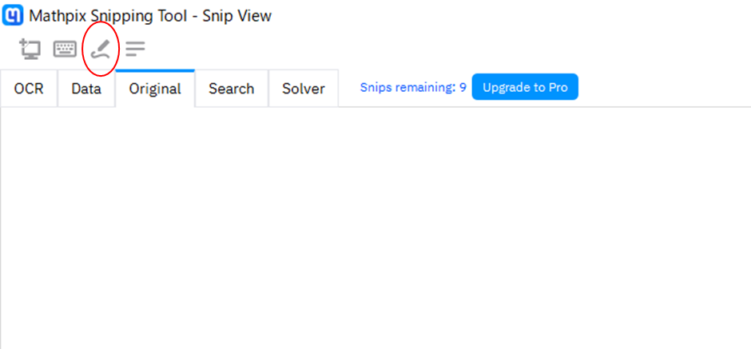{:height="400px"}

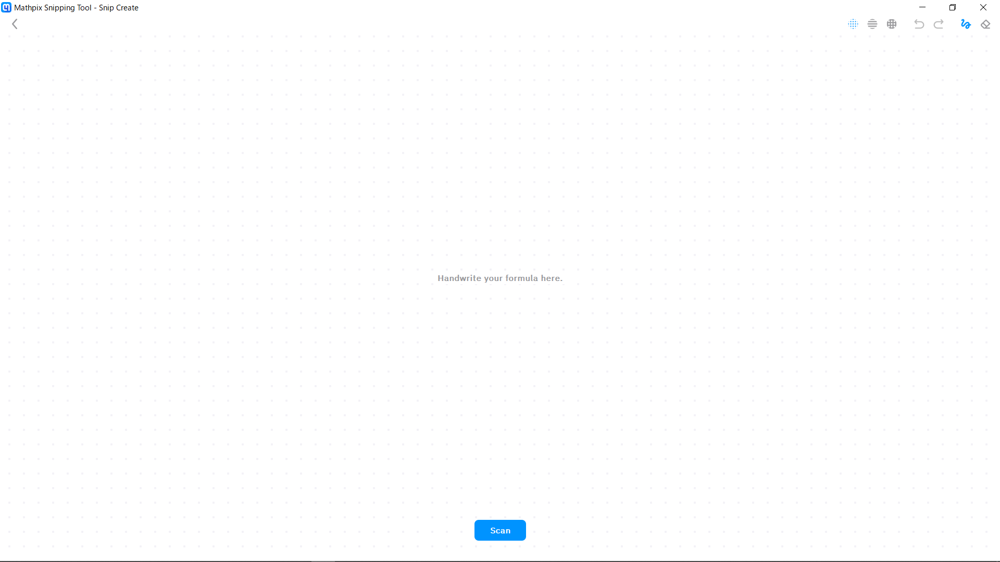{:height="400px"}

「Handwrite your formula here」という文字とともに画面が表示されるので，数式を記入します．

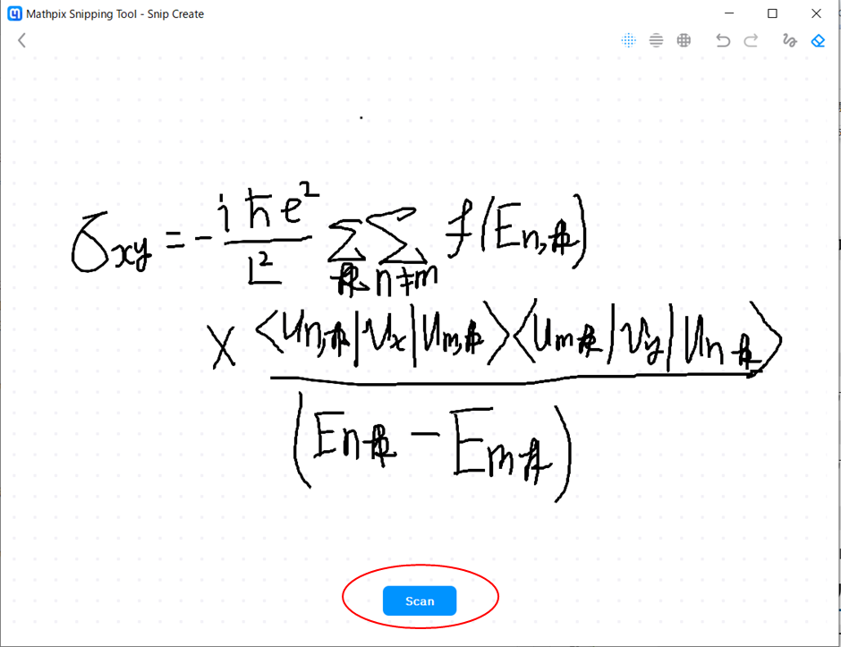

記入したら，Scanボタンを押します．

すると上のように，マウスで書いたような読みにくい文字でも（一部誤変換はありますが）かなりよい精度で，数式として読み取ってくれます．（無料版では1カ月に10回．それ以上は有料のMathpix Proに申し込む必要があります．）

このように手書きした数式はMathpix内に保存されます．

また，数式の読み取りだけでなく読み取った数式の簡単な解析もすることができます．

数式を読み取った後［Solver］をクリックします．

すると，解とグラフが出力されます．

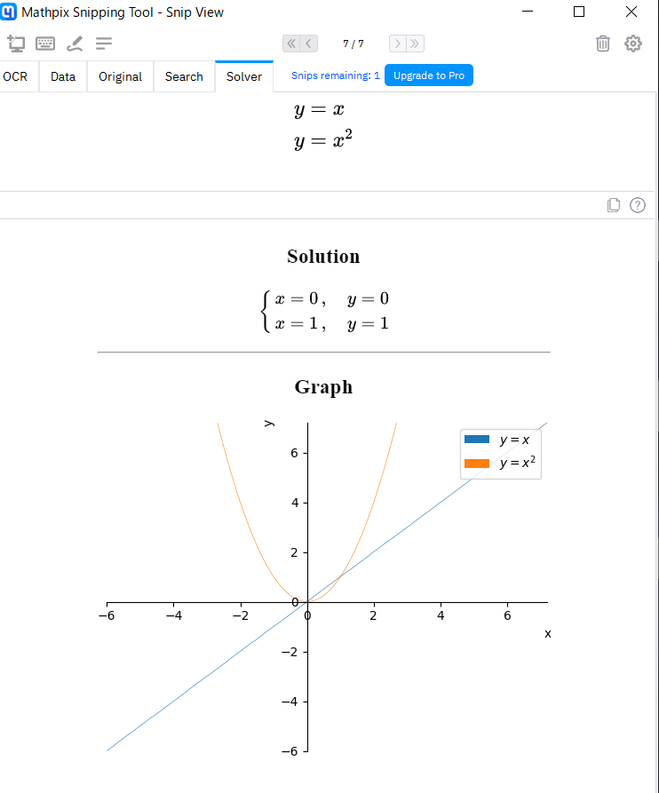

このように，簡単な関数であれば解の計算やグラフの出力をすることが可能です．（やや複雑な数式になると解の計算の精度は落ちていくので注意が必要です．）

#### 3．まとめ

ここではWordでの基本的な数式の記入法，ならびにMathpixの使い方や特徴について取り上げました．

Wordでは［挿入］タブから［数式］を選択することで数式の入力ができます．直接記入できるため記入の準備は必要ないですが，一つ一つの文字を選択していく必要があるため手間と時間がかかってしまいます．

また，手書きでの入力も可能ですが，一部の記号が読み取れないことや，複雑で長い数式だと読み取りが難しいなどの欠点があります．

Mathpixは，パソコンのスクリーン上から数式を読み取ることができるため，複雑な数式でも読み取りと出力が可能です．また，手書きで読み取ることもでき，文字の精度が粗くてもある程度読み取ってくれます．ただし，読み取り回数は1カ月に10回までという制限があり，それ以上は有料版にアップグレードする必要があります．

### グラフの作成方法

#### 1．Excel

ここでは，Microsoft Excelでの基本的なグラフの作成方法について紹介します．（バージョン：Windows10，Excel 2016）

まず，下図のようにデータを選択します．

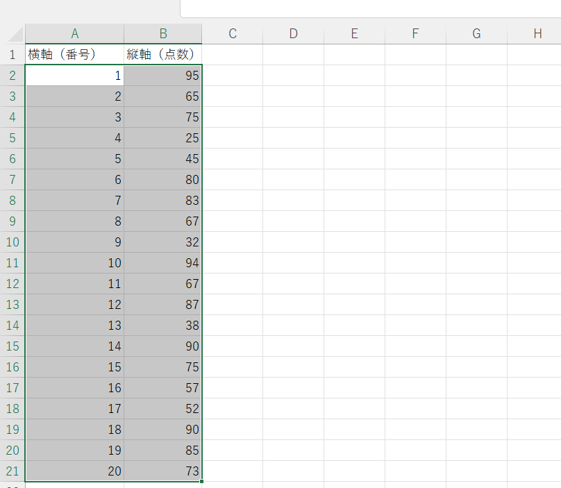

次に上部の［挿入］タブをクリックし，グラフを選択すると様々なグラフを作成することができます．

表示させたいグラフを作成したら，［グラフのデザイン］，［書式］タブが表れます．

ここではグラフの詳細の設定ができます．例えば「グラフ要素を追加」をクリックすると，グラフのタイトルや軸の設定などができます．

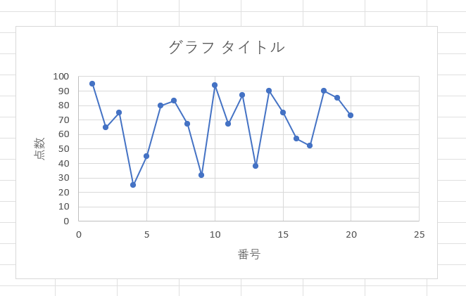

このようにExcelはデータをグラフにすることを得意としています．

#### 2．GeoGebra

ここでは，数式等からグラフを簡単に作成できるGeoGebraの特徴について説明していきます．

[Geogebra](https://www.geogebra.org/?lang=ja)のホームページに飛び，［アプリの開始］をクリックするとグラフの作成画面に飛びます．そこからグラフの作成ができます．

画面の下にキーボードが表示されるので，それを用いて表示したい数式を記入していきます．記入が終わると，画面にグラフが生成されます．複数のグラフを記入したい場合は，［入力］をクリックし，新しい数式を記入していくことで，新しいグラフを挿入できます．

<figure>

<figcaption><a href="https://www.geogebra.org">https://www.geogebra.org</a>, Byju's</figcaption>
</figure>

グラフの軸や目盛り等の詳細設定は設定ボタン（下図の丸で囲ったボタン）から変更できます．
x軸やy軸の単位やラベルの設定ができます．

<figure>

<figcaption><a href="https://www.geogebra.org">https://www.geogebra.org</a>, Byju's</figcaption>
</figure>

<figure>

<figcaption><a href="https://www.geogebra.org">https://www.geogebra.org</a>, Byju's</figcaption>
</figure>

作成した画像のエクスポートは左上の赤丸で囲った部分から選択することができます．
「・・・形式でダウンロード」を選択するとpdfやpngファイルなどでダウンロードできます．

また，二次元座標系だけでなく，空間図形の描画など，様々なことができます．

<figure>

<figcaption><a href="https://www.geogebra.org">https://www.geogebra.org</a>, Byju's</figcaption>
</figure>

GeoGebraの特徴は，数式を記述すれば簡単にグラフが出力できることです．その他にも多角形や空間図形の描画，数式計算など，できることが幅広くあります．

#### 3．Python

この章ではプログラミング言語のPythonを用いたグラフの作成方法について紹介します．ここでは環境構築の必要がないGoogle Colaboratoryを用います．

まず，Pythonについて説明します．Pythonは，Guido van Rossum氏が1991年に発表したプログラミング言語です．豊富な標準ライブラリ（プログラムで実行する比較的高度な処理に必要な機能をまとめたもの）があり，それを利用することで簡単に処理を行えるのが特徴です．

まず，[Google Colaboratory](https://colab.research.google.com/?hl=ja)を開きます．

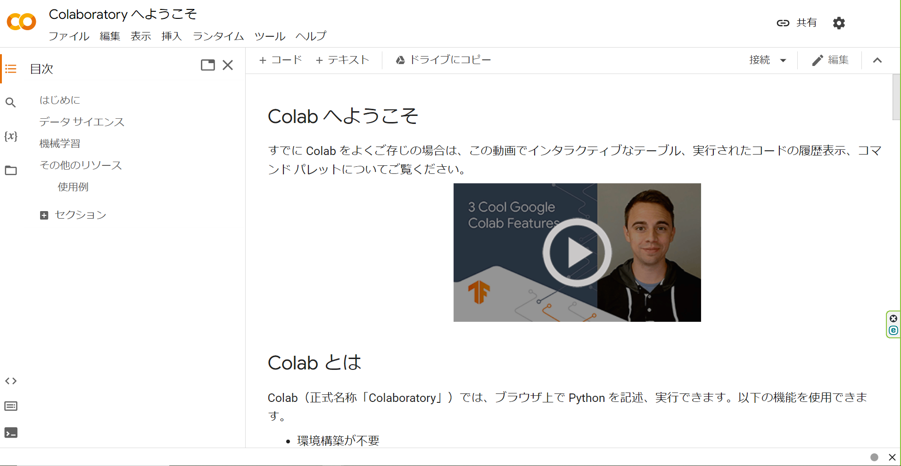

Google Colaboratoryと検索すると，上図のようなページが出てきます．

ここにGoogle Colabratryについての説明も載っています．グラフ作成にあたっては，「データサイエンス」の説明文が参考になるかもしれません．また，ライブラリであるMatplotib，NumPyもグラフ作成に便利です．

［+コード］をクリックするとプログラムが書けるようになります．

プログラムを書き，［→］ボタンを押すと実行され，グラフが出力されます．

記入したプログラムは［ファイル］タブからGoogle Driveに保存することができます．

ExcelやGeogebraと比較したPythonの長所は，プログラムを組めば自分の好みにあったグラフの作成や数値計算が自由にできることです．

#### 4．まとめ

ここでは，Excelで基本的なグラフの作成法，ならびにオンラインツールの使い方や特徴について取り上げました．

Excelではデータを選択した後，［挿入］タブから様々なグラフを作成することができます．

Geogebraでは，数式を記入することでその数式を表現したグラフを作成できます．数式を記述するだけで簡単にグラフが出力されること，空間図形の描写など幅広い機能を備えていることが特徴です．

PythonはGoogle Colaboratoryを用いることで，環境構築の必要なくすぐに起動することができます．また，プログラムを組むことができれば，幅広い応用が可能です．

## 紙媒体を電子媒体に変換する方法，保存方法

この章では主に手書きのメモなどの紙媒体を電子媒体に変換する方法や，それを保存するのに便利なオンラインツールについて紹介します．

#### 1．Microsoft Lens

手書きのメモや印刷された文字を撮影し，電子媒体に変換できるツールについて紹介します．同様の画像認識アプリは複数存在しますが（Googleレンズなど），ここではマイクロソフトが提供するMicrosoft Lensについて説明します．（使用機器はGalaxy A32 5Gです．）

まず，Microsoft Lensをインストールし，起動します．

起動すると撮影画面になるので，変換したいものを写真に撮ります．

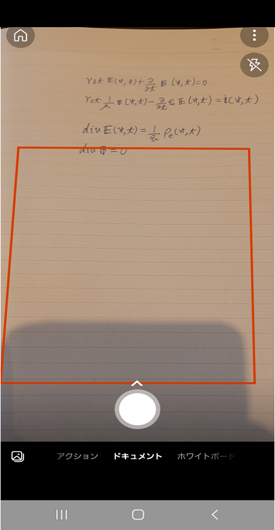

撮影したら，変換する写真の範囲をトリミング機能で選択します．

トリミングを行い確認ボタンを押すと，下図の「フィルター」から画像の明るさ等の調整を行うことができます．

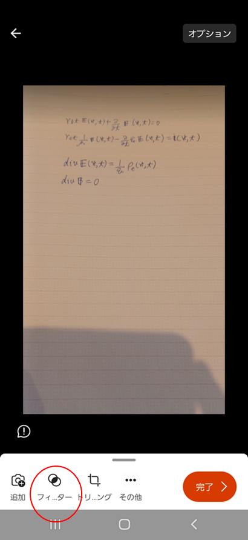

完了ボタンを押すと，変換が行われます．PDF，Word，PowerPointファイルに変換することが可能です．変換されたファイルはMicrosoft OneDriveに保存されます．

このように，Microsoft Lensは手書きのレポート等を，写真を撮るだけで簡単に短時間で電子ファイルに変換することができます．

#### 2．Google Keep

ここでは，画像やメモを保存できるツールとしてGoogle Keepを取り上げ，その特徴について説明します．主な使い方は[Google Keepのヘルプ](https://support.google.com/keep/answer/2888240)で確認してください．

Google Keepは画像を保存することが出来るほか，画像のテキストの抽出を行うこともできます．ここでは，読み取った画像内に含まれるテキストを抽出する方法について紹介していきます．

まず，スキャンした画像をGoogle Keepに読み込ませます．

<figure>

<figcaption><a href="/en/improvement/">https://utelecon.adm.u-tokyo.ac.jp/en/improvement/</a></figcaption>
</figure>

<figure>

<figcaption><a href="/en/improvement/">https://utelecon.adm.u-tokyo.ac.jp/en/improvement/</a></figcaption>
</figure>

読み込むと画像が表示され，下にスクロールするとタイトルやメモの記入ができます．

また，下部のアイコンから背景の選択や図形の追加などの操作を行うことができます．

<figure>

<figcaption><a href="/en/improvement/">https://utelecon.adm.u-tokyo.ac.jp/en/improvement/</a></figcaption>
</figure>

「画像のテキストを抽出」をクリックすると，上図のように，画像内に書かれている文字が画像の上から順に表示されていきます．（画像を読み込んでからテキストの抽出ができる状態になるまでに少し時間がかかります．また，テキストの一部が読み込まれない場合もあります．） 抽出したテキストは編集が可能なので，分からなかった文や単語を調べる際にコピーすることで，手打ちで打ち込むより時間が短縮できます．

#### 3．まとめ

ここでは，紙媒体の電子媒体への変換や，その保存などに役立つオンラインツールについて取り上げました．

Microsoft Lensは手書きメモなどを写真撮影することで，簡単に電子媒体に変換することができ，レポート提出の際などにとても便利です．

Google Keepは紙媒体を画像にして保存することができるほか，メモや画像内のテキストを抽出することが可能です．

