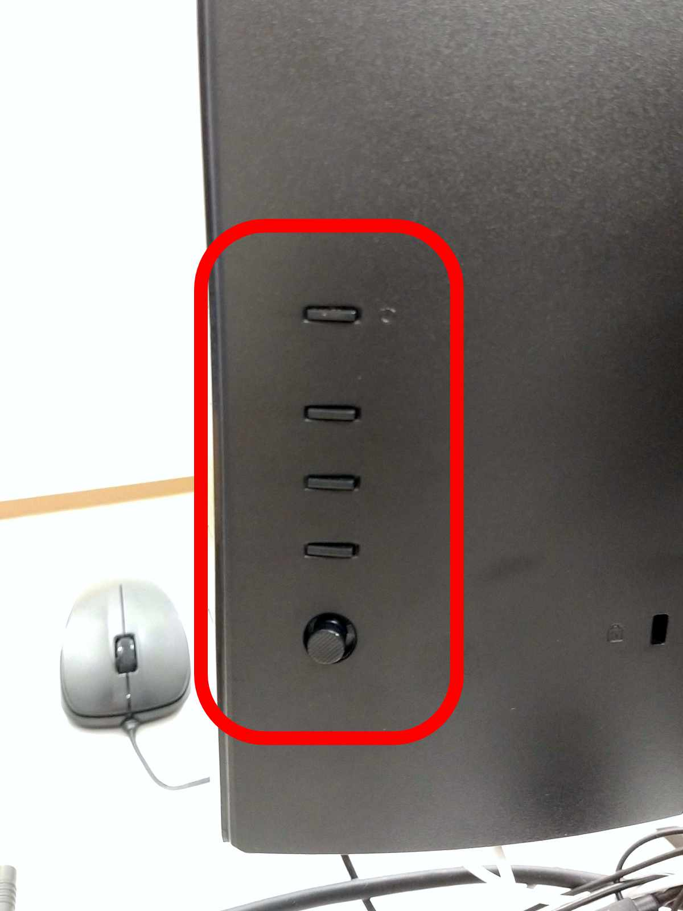
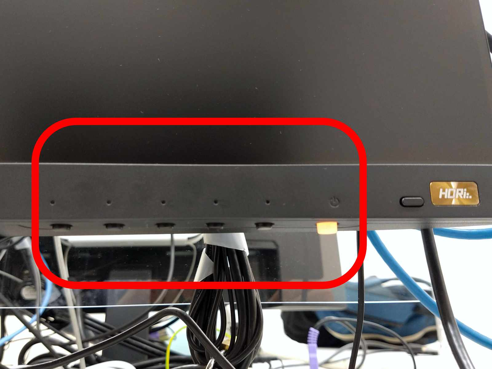

ECCS端末ではディスプレイの明るさや色合いを変えたり，ディスプレイの表示がおかしい場合にリセットしたりすることができます．端末の種類によって方法が異なるため，利用する端末にあった方法を確認してください．

## Mac mini端末の場合

設定を変更するためのボタンがディスプレイ（Acer V277）背面にあります．上から電源ボタン，ホットキー1～3（3は入力切替用），ジョイスティックです．

{:.border}{:.small}

なお，ディスプレイがHDMI入力を認識していない状態では，明るさや色合いなどの設定は変更できません．

### 明るさ変更手順

1. 電源ボタン以外のいずれかのボタンを押してください．
2. デフォルトではホットキー2（中）に「Brightness」（輝度）が割り当てられているので，そのボタンを押してください．
   - ホットキーに割り当てがない場合は，ジョイスティックを3回押し込んで「Menu」（メニュー）に入り，「Picture」（画質調整）を選択して「Brightness」（輝度）の設定に入ってください．
3. ジョイスティックの左右で値を調節したあと，ジョイスティックを押し込んで設定を確定してください．

### 色合い変更手順

1. 電源ボタン以外のいずれかのボタンを押してください．
2. デフォルトではホットキー1（上）に「Mode」（モード）が割り当てられているので，そのボタンを押してください．
   - ホットキーに割り当てがない場合は，ジョイスティックを押し込んで「Menu」（メニュー）に入り，ホットキー2（中）を押すことで「Mode」（モード）の設定に入ってください．
3. ジョイスティックの上下左右で「Standard」（標準）を選択したあと，ジョイスティックを押し込んで設定を確定してください．

### 設定初期化手順

1. 電源ボタン以外のいずれかのボタンを押してください．
2. ジョイスティックを押し込んで「Menu」（メニュー）に入り，ホットキー1（上）を押すと情報画面に入る．
3. 「Reset All Settings」を選択してすべての設定をリセットしてください．

## iMac端末の場合

画面の輝度は端末起動時に一律50%に設定されています．設定した輝度設定を保存できないので，端末を利用する都度，各自でお好みの輝度に調節してください．輝度の設定方法は何通りかあります．

### Mac環境・Windows環境共通の輝度変更手順

キーボード上のF1キーを輝度を下げ，F2キーで輝度を上げることができます．

### Mac環境の輝度変更手順

1. 上部メニューバーのアップルマークより「システム環境設定」を選択してください．
2. 「ディスプレイ」を選択してください．
3. 「輝度」のバーを動かして輝度を調節してください．

### Windows環境の輝度変更手順

1. 画面左下のWindowsマークをクリックしてスタートメニューを開き，設定アイコン→「システム」→「ディスプレイ」の順に選択してください．
2. 「内蔵ディスプレイの明るさを変更する」のバーを動かして輝度を調節して下さい．

## Chromebox端末の場合

設定を変更するためのボタンがディスプレイ（BenQ EW2780）下部にあります．左から操作ボタン5つ，電源ボタン（ランプ付き）です．赤囲みの右側は通常使用しないHDRボタンです．

{:.border}{:.small}

1. 電源ボタン以外のいずれかのボタンを押してください．
2. 左から4番目のボタンを押してメニューに入ってください．メニュー画面における各ボタンの機能は，左から「上に移動」「下に移動」「決定」「戻る」「終了」です．
3. 設定を変更してください．
   - 明るさ：「Picture」→「Brightness」で変更してください．
   - 色合い：「Color」→「Color Mode」で変更してください．
   - 設定初期化：「System」設定から行ってください．

## 関連

Mac mini端末の画面が表示されなかったり，No Signalと表示されたりする場合は，ECCS相談員のページ「[Mac mini端末の画面が表示されない／No Signalと表示される](https://www.sodan.ecc.u-tokyo.ac.jp/faq/mac-mini-no-signal/)」を参照してください．