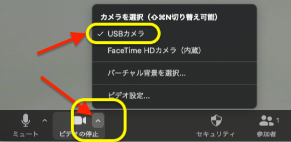

## はじめに

ECCS端末のMac環境，Windows環境ではZoom, Google Meet, Webexを利用することができます．このページではそれぞれのWeb会議システムのECCS端末での利用方法について説明します．

なお、学内でZoomなどで発声の伴うミーティングを行う場合、部屋ごとに発声可否などのルールが異なるため、部屋の管理者に予めご確認ください.

## 機器の接続について

USB接続の書画カメラ，ペンタブレット，ヘッドセット，スピーカーフォンなどのうち，ドライバのインストールが不要な装置を接続して使うことができます．なお事前のテストをお勧めします．

* 端末の下部にUSB延長ケーブルが出ていて，そこに接続できますが，本体後ろの空いているUSB端子を使うこともできます．それでも足りない場合はユーザ持ち込みのUSBハブを使っていただくことになります．
* 端末の下部に4極のオーディオ延長ケーブルが出ていて，ここにヘッドセット（マイク付きヘッドホン）を接続できます．マイクが認識されない場合は，オーディオ延長ケーブルが本体に接続しているコネクタを抜き差ししてみてください．

## Google Meet

Mac環境，Windows環境共に多くのブラウザで利用可能ですが，Meetの提供元のGoogle社の提供するChromeを使うのがお勧めです．他のテレビ会議システムでも同様ですが，テレビ会議システムに使うカメラやマイクを使用する際にはダイアログが出て，システム環境設定での変更が必要になる場合があります．

## Zoom

Mac環境では，アプリケーション (`/Applications`) の下に zoom.us という名前でインストールされています．ブラウザから起動する場合は，該当会議のURLにアクセスして，システムダイアログが表示されたら「zoom.usを開く」をクリックしてください．

Windows環境では，デスクトップ上に Zoom という名前のショートカットがあります。ブラウザから起動する場合は，該当会議のURLにアクセスして，システムダイアログが表示されたら「Zoom Meetingsを開く」をクリックしてください．

### USBカメラの利用

Zoomの画面左下のカメラのアイコン右側の「＾」印を左クリックすると「カメラを選択」の画面が表示されます．その中の`XXXX USB カメラ (Camera)`を選択すると， USB接続のカメラの画像が取得できます．

## Webex

Mac環境では，アプリケーション (`/Applications`) の下に Webex という名前でインストールされています．ブラウザから起動する場合は，該当会議のURLにアクセスして，「ブラウザから参加してください」をクリックしてください．

Windows環境では，デスクトップ上に Webex という名前のショートカットがあります。ブラウザから起動する場合は，該当会議のURLにアクセスして，システムダイアログが表示されたら「Webexを開く」をクリックしてください．