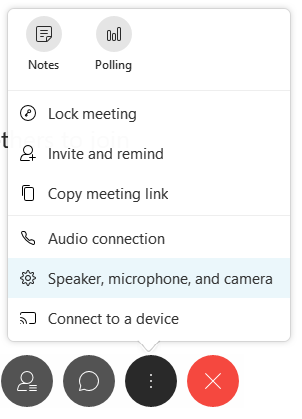
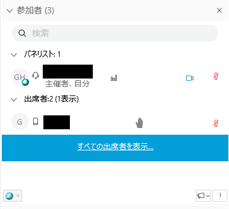
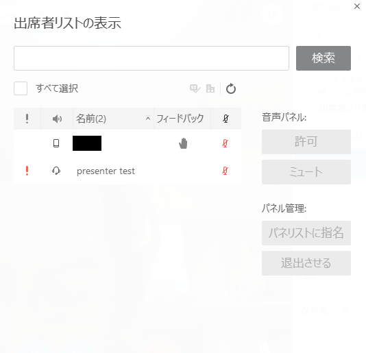
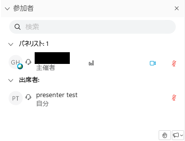
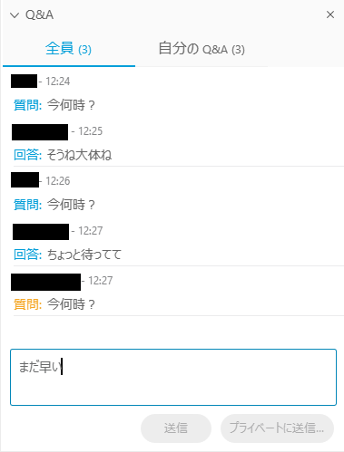
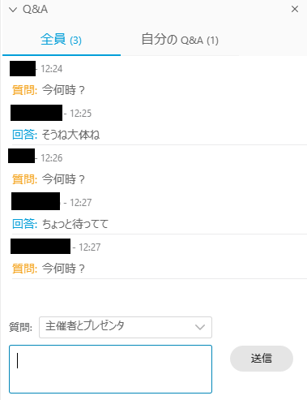

## Roles

Webex Event has the following roles.
* **Host**： In addition to starting and ending the event, you have control over the roles of other participants.
* **Presenter**： You can share content with others, and can also mute/unmute yourself.  
* **Panelist**： You can answer Q & A from participants, and can also mute/unmute yourself.  
* **Managing Polls**：  Any one of the host, presenter, or the panelists can be in charge of creating a poll.
* **Participants**： Video images of the participants will not be shown (the participants' camera will be turned off completely), and they cannot unmute themselves unless the host does. Also, since it is assumed that participants of the event do not know each other, chatting is not possible between the participants.  The participants can only chat with the host, the panelists and the presenter. The Q&A is the only platform on which participants can view other participants' messages.

## Screen composition

* Once you join an event, the screen will look as the following:

	{:.small}

* There are buttons at the bottom of the screen. This screen is what it looks like for the host; Participants have fewer buttons. Move the mouse over the button to display the name. We will explain each icon from left to right.

	{:.medium}
	1. **Mute**： When black, the microphone is on. It turns red when muted. **Participants cannot unmute themselves**
	1. **Stop video**： When black, the camera is on. It turns red when the camera is off.
	1. **Contents sharing**： Only presenters can share contents. This is a function for sharing screens and sharing materials with other participants.
	1. **Recording the meeting**： Only the organizer can start and stop recording. You can record the meeting. You can leave it either on the cloud (Webex server) or on your computer, but depending on your settings, recording on your computer may be disabled.
	1. **Participants**： Press the participant button to display the list of participants.
	1. **Chat**： Pressing the chat button will bring up a chat window where you can send a message to everyone or a specific person. Participants can only chat with the host, presenters and panelists.
	1. **Other settings**： There are other settings here. You can make settings such as stopping anyone else from joining the event, playing a sound when a  participant enters the room, or have participants enter on mute. The voting function cannot be performed in a browser, and requires a desktop application.
	1. **Leave**： Leave the meeting.

以下，主に利用するメニュー項目について，追加で詳細を説明します．

## Screen sharing
	
When you press "Share Content", the options of which screen to share will appear. Select the one to share and press "Share" to start.

{:.small}
	
* When "Screen 1" is selected, the screen of the person sharing the screen itself is shared with everyone (If you have multiple screens on a multi-monitor, the number of choices increases to Screen 1, Screen 2, and so on).
* The window that is currently open is also displayed as an option. You can also share the screen in window units. If you don't want to show anywhere other than one window, we recommend that you select the window to share.
* If you select "New Whiteboard", a whiteboard that you can draw on freely will be shared with everyone.

## Advanced settings for speaker, microphone and camera

{:width="300px"}

Click on "Other Options" and then "Speakers, Microphones, Cameras" to set and check the speaker / microphone / camera. Since attendees cannot send video images, their settings become only "speakers and microphones" and cannot set cameras.

* **Speaker** : You can select the speaker you want to use (if you have a separate speaker, you will have multiple choices, so select the one you want to use). Click "Test" to hear a confirmation sound.
* **Microphone** : You can select the microphone you want to use (if you have a separate microphone, you will have multiple choices, so select the one you want to use). If the sound is properly picked up from the microphone, the meter below will swing. Check "Automatically adjust audio" if necessary.
* **Camera** : You can select the camera you want to use (if you have a separate microphone, you will have multiple choices, so select the one you want to use). A preview of the camera view is displayed immediately below.

## Participants

Pressing "Participants" will bring up a screen where you can see a list of participants.

{:.small}

The left is how the window will look like from the host side, and the right side is the window displayed when you click "Show all attendees...".

How it looks from the Participants' side:

* **Hand icon**： Pressing the hand icon in the lower right means "raising your hand", which will show the host that you are raising your hand. In the figure above, the person participating from the tablet is raising his hand. The list of participants who have not raised their hands can be seen by clicking "Show all attendees ...".
* **Microphone icon**： A red microphone icon indicates that the participant's microphone is muted. The host can also mute participants' microphones. In the figure above, the microphone of a test attendee is muted.
* **Megaphone icon**： You can send feedback (reaction) to the host, presenter and panelists.
* **Panelist promotion**： While viewing the attendees list, select a participant and press "Promote to panelist" to change to a panelist. Once you become a panelist, you can also change to a presenter from there.

## Chat
	
Press "Chat" to enable text chat. You cannot read the chat history before you have joined. 

	
* **Save to**： You can change the recipient of the chat message.

## Q&A
	
Press "Q & A" to send a question to the host, presenter and panelist.

* The left photo shows how the host's screen looks like, and the right photo is the participant's screen. Once the questions have been answered, both the questions and answers will be shared to all participants. People who participated in the event midway can also read the past Q & As.
* You can choose to send questions to only the host, and not to the other participants of the meeting.

 
 
<a href="index" target="_blank">Back to How to Use Webex</a>
