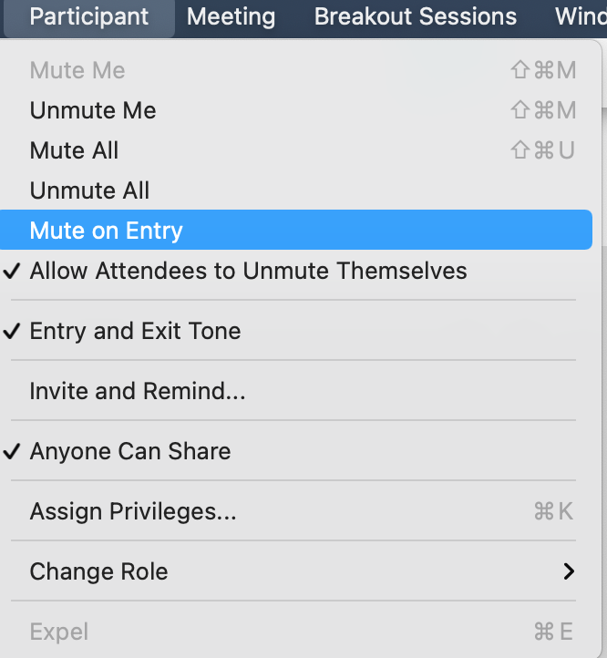
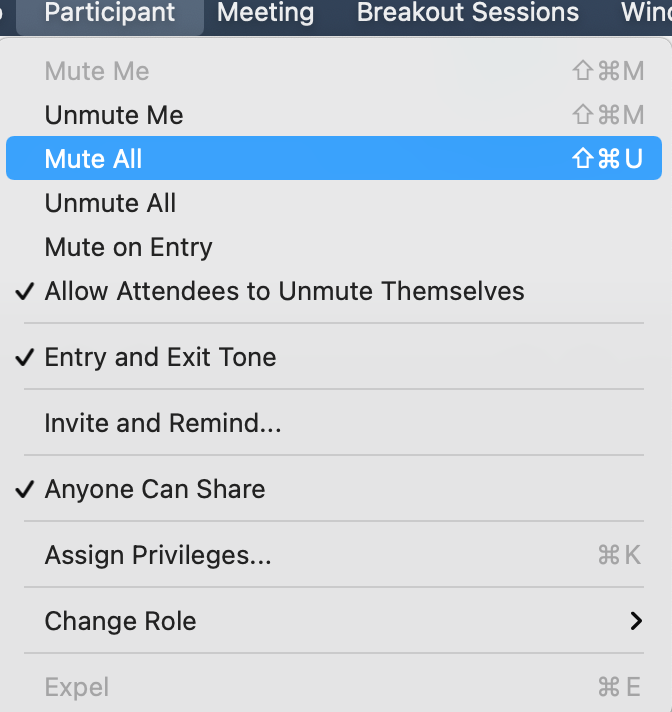
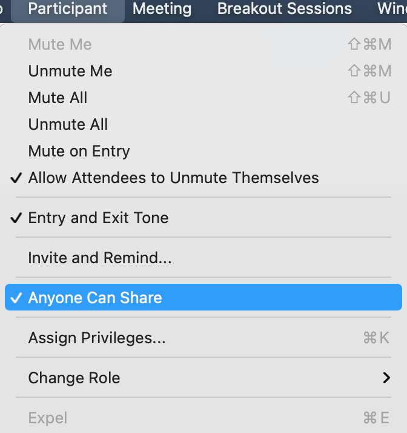
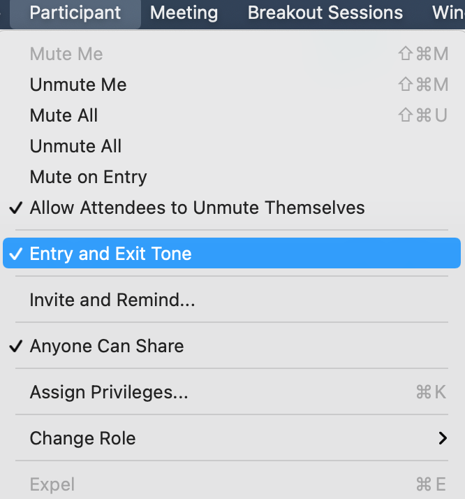
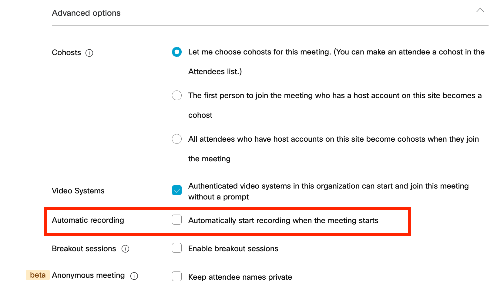
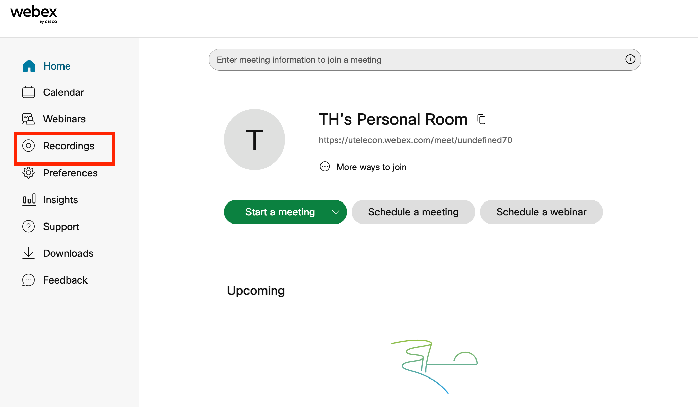
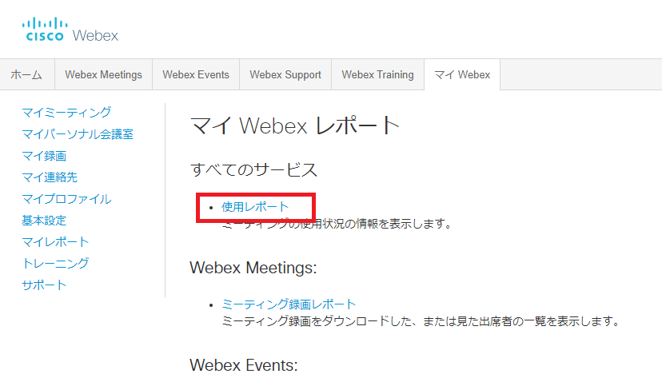
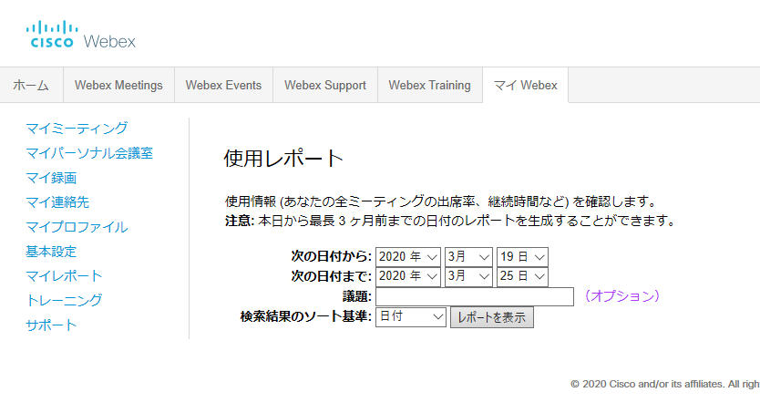
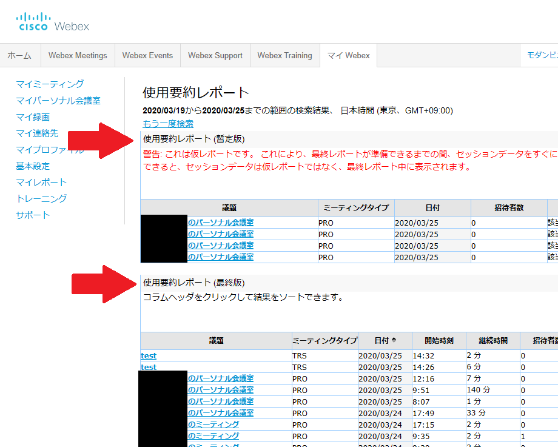
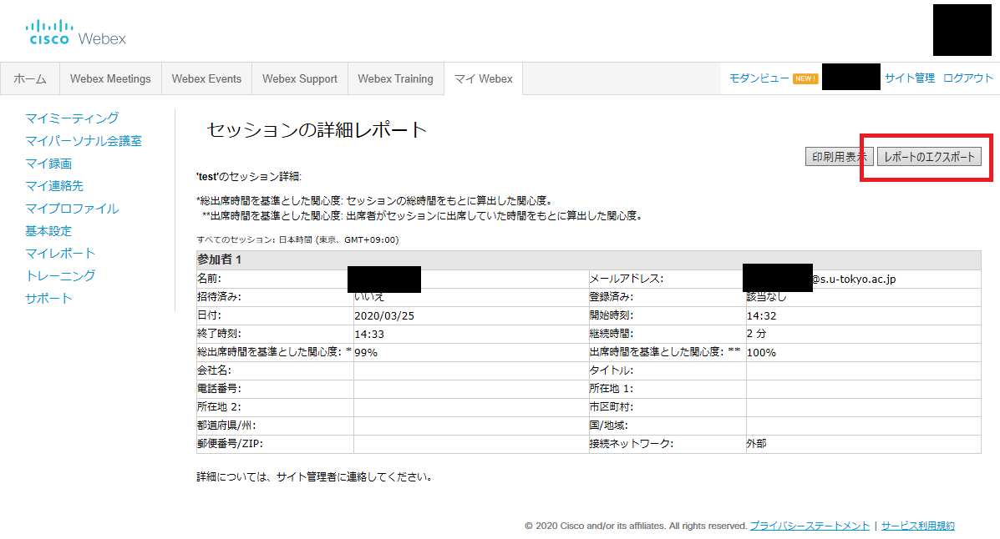

* In this section, we will explain the Webex Meetings functions that are unique to the Host of the meeting.
* Click <a href="do_meeting" target="_blank">here</a> to see the basic features of Webex.

## Options unique to the host

### Mute all participants

* In the initial setting of the meeting, you can turn on "Mute" when entering the room.
* Even after the meeting starts, the "Participant" menu has a function called "Mute when joining".

		

* The "Participant" menu has a function called "Mute all", so you can mute everyone immediately.

	

### Content sharing restrictions

* You can restrict content sharing by anyone other than the person who is assigned as the "Presenter" by the host.
* The "Participant" menu has a function called "Anyone can share". If you uncheck this, you can prevent content sharing from unexpected participants.

	

### Participant entry / exit sound

* Sounds can be played when participants enter and leave the room. It can prevent unexpected participants from joining unnoticed, but can be disrupting in conferences with many participants.
* In the initial setting of the meeting, you can set the sound for entering and leaving the room.
* Go to the "Sound of entry / exit" in the "Participant" settings.

	

### Recording

* By recording the entire meeting and publishing it on ITC-LMS etc. (publication method TODO), it can be used as a learning material for students who had poor network conditions or for the students to revise afterwards.
* Recording can be done at any time by setting "Automatic Recording" when setting up the conference, or by clicking the recording icon during the conference.

	{:width="400px"}

* Recorded video files are automatically saved in MP4 format and saved in the recording menu area on the home screen. You can download it or you can get a link (URL) with a password to share.

	{:width="400px"}
	{:.medium}

### Return as the "Host"

* If the host disconnects from the meeting due to network trouble, etc., the role of the  "Host" will be assigned to another participant.
* In that case, after re joining as a participant, press "Regain the role of the host" from the "Participant" menu and enter the "Host Key" that was displayed when the meeting was created. Then, you can reassume the role as the "Host."

	{:width="300px"}

* If you set "Join before host" in "Scheduling options" when scheduling a meeting, participants can enter the meeting room before the host has started the meeting. If the participant does "Regain the role of the host" here, it becomes possible for the participant to become the "Host" and proceed with the conference.

	{:.medium}

### Participants

* You can download a record of who attended the meeting at what time.
* It will take some time after the meeting ends for the report of the attendees to be generated.

1. From "Analysis" on the home screen, click "Show all" on the upper right.
{:.medium}
1. Click on "Usage Report".
{:width="500px"}
1. Search for the meeting you held. Enter the date and agenda and click "View Report".
{:width="500px"}
1. A list of meetings will be displayed. If it is displayed in the "Usage summary report (provisional version)", a proper report has not been generated yet. Please wait for it to be displayed in the “Usage Summary Report (final version)”. Click on the agenda name.
{:width="500px"}
1. A list of participants' attendance will be displayed. Click "Export Report" to download the displayed content as a CSV file.
{:.medium}

## What Webex Meetings cannot do 

* It is not possible to conduct group work on WebEx because it does not have the function to divide participants into groups. If you want to do group activities, we recommend <a href="/en/zoom/" target="_blank">Zoom</a> or Webex Training.

 
 
<a href="index" target="_blank">Return to "How to use WebEx"</a>

