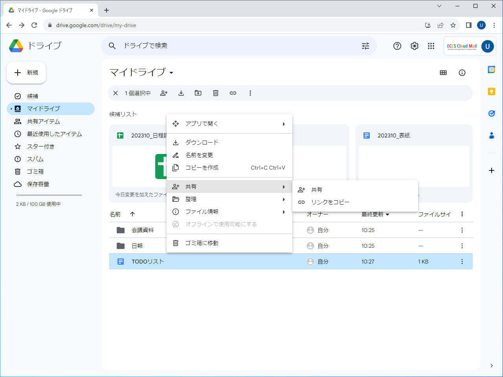
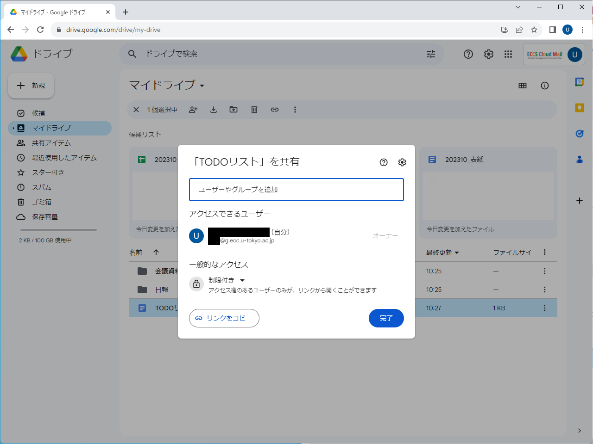
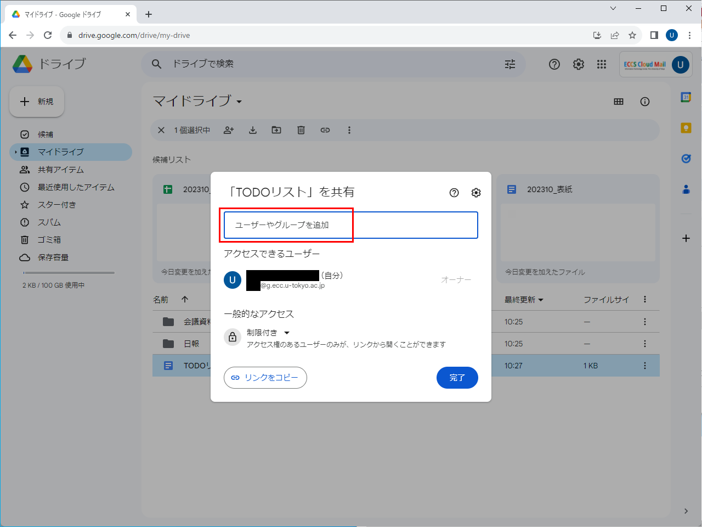
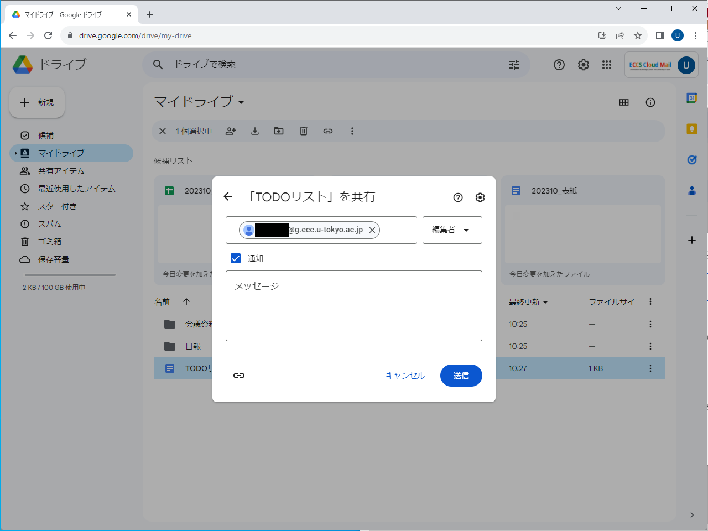
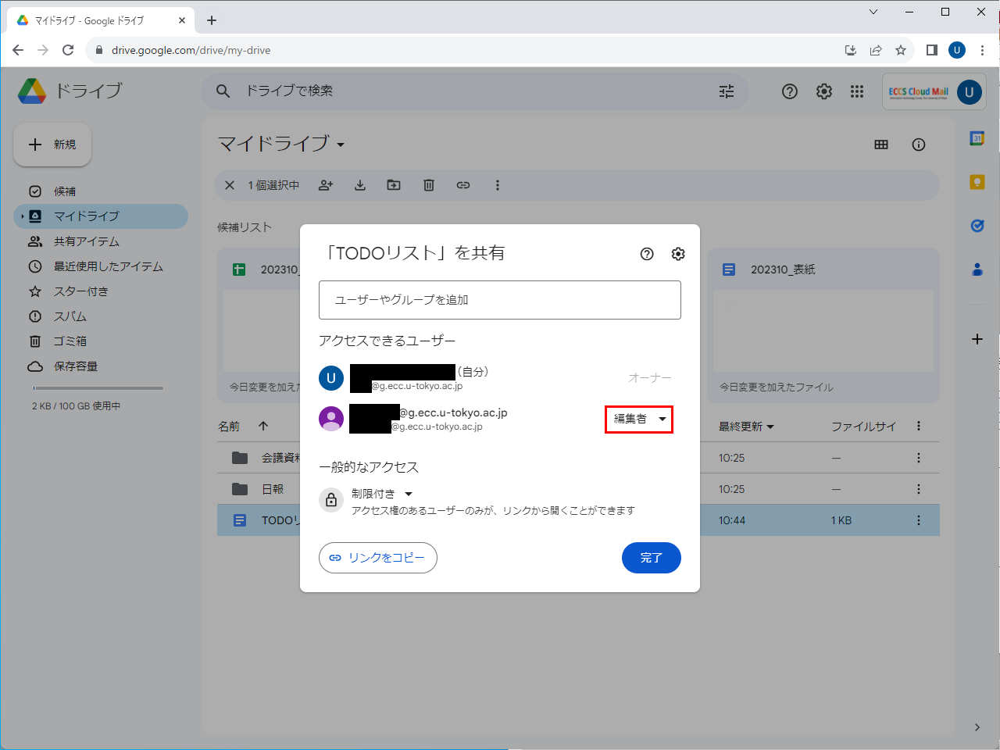
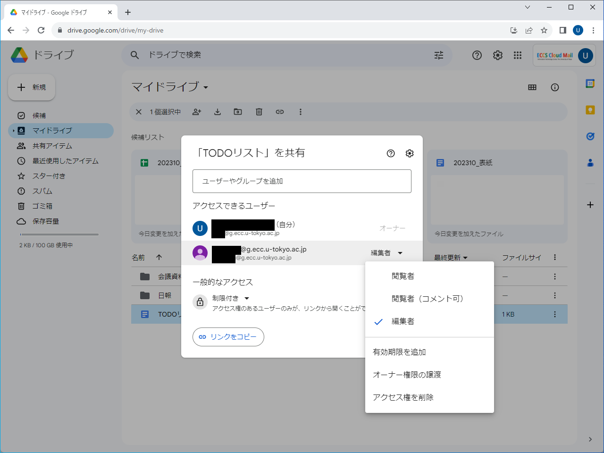

[Googleドライブのページのトップに戻る](.)

## はじめに

このページでは，Googleドライブに保存されたファイルを他のユーザーに共有する際の具体的な操作手順や設定内容について説明します．

なお，Googleドライブの利用についての全般的な説明は「[Googleドライブ](.)」に，ファイルを作成・編集・アップロード・ダウンロードする方法については「[Googleドライブの基本的な使い方](basic)」に記載されています．あわせて参照してください．

加えて，ファイルを共有する際に推奨される利用方法をケース別に説明したページ「**[Googleドライブ ファイル共有のおすすめの利用方法](recommendation)**」や，ファイル共有方針の提案として生産性や安全性を高める使い方を説明するページ「[クラウドストレージを用いた新しいファイル共有方針の提案](/online/topics/share_policy)」も必要に応じて参照してください．

### Googleドライブの動画
このページで説明しているGoogleドライブのファイル共有方法を動画でも説明しています．

<iframe width="560" height="315" src="https://www.youtube.com/embed/HkEAV69sv4c?si=vGTrqsXfYm0gBdhv" title="YouTube video player" frameborder="0" allow="accelerometer; autoplay; clipboard-write; encrypted-media; gyroscope; picture-in-picture; web-share" allowfullscreen></iframe>

## ファイルやフォルダを共有する

Googleドライブの共有機能では，自分のGoogleドライブにあるファイルやフォルダを，自分以外の他の人がアクセスできるようにし，閲覧・編集してもらうことができます．

共有する際は，ファイルやフォルダごとに，アクセスできる人の範囲と，その人に対して認めるアクセス権（認める操作の範囲）などを設定することになります．その上で，アクセスを認めた人に対してファイルやフォルダのリンクを伝えることで，相手はそのリンクを経由してファイルやフォルダを閲覧・編集できるようになります．

以下，それぞれについて概要を説明し，その後に具体的な手順を説明します．

### 設定の概要

#### アクセスできる人の範囲の設定方法
{:#target}

アクセスできる人の範囲を設定する方法は，以下の2種類に分かれています．

- 個別に相手を指定して設定する
    - 個別に相手のメールアドレスを指定して設定を行う方法です．
    - 基本的には，Googleアカウント（東京大学の構成員の場合は `@g.ecc.u-tokyo.ac.jp` で終わるECCSクラウドメールのアカウント）を指定します．
    - Googleアカウント以外のメールアドレスを指定することも可能ですが，共有相手がファイルやフォルダにアクセスする方法が少し異なる「ビジター」という扱いになります．
    - Googleグループのメールアドレスを指定することも可能です．そのグループに参加しているメンバーがアクセスできるようになります．
- 不特定の人をまとめて指定して設定する
    - そのファイル・フォルダのリンクを知っている人であれば，誰でもアクセスできるようにする，という設定です．
    - 誰でもアクセスできるようにする設定と，東京大学のECCSクラウドメールのアカウントを持っている人に限り誰でもアクセスできるようにする（ECCSクラウドメールのアカウントを持っていない人を除外する）設定の，2つの設定が可能です．
    - Googleドライブの画面上では「一般的なアクセス」と呼ばれています．

2種類の設定を組み合わせることも可能です．具体的には，たとえば「同じチームのメンバーは個別に指定して編集を認め，閲覧だけであれば誰でもできるようにする」といったことができます．

<!-- 別途ユースケースのページもできるが，ここに使い分けを簡単に書いておくとよさそう -->

#### アクセス権の種類
{:#access-level}

共有相手に対して認めるアクセス権（認める操作の範囲）は，以下があります．

- **閲覧者**
    - ファイルを閲覧することはできますが，編集はできません．
- **閲覧者（コメント可）**
    - ファイルを閲覧することに加えて，コメントを追加することができます．また，Googleドキュメントのファイルの場合は，編集の提案も行うことができます．ファイルを直接編集することはできません．
- **編集者**（[共有ドライブ](shared_drive)の場合は「**投稿者**」）
    - ファイルの閲覧と編集が可能です．

※「共有ドライブ」機能を利用している場合は，以上のほか「**コンテンツ管理者**」「**管理者**」というアクセス権があります．詳細は，[Googleドライブの「共有ドライブ」機能について](shared_drive)のページを参照してください．

#### その他の設定

その他，次のような設定ができる項目もあります．具体的な設定方法は下の手順で説明します．

- 「編集者」のアクセス権を認めた共有相手によるさらなる共有の可否を制御する設定
    - デフォルトでは，「編集者」のアクセス権を持っている共有相手は，そのファイルをさらに別の人に共有することが可能です．この動作を変更し，「編集者」のアクセス権を持っていても，さらに他の人に共有することはできない，という動作にする設定が可能です．
- 「閲覧者」「閲覧者（コメント可）」に対してダウンロードなどを禁止する設定
    - デフォルトでは，「閲覧者」「閲覧者（コメント可）」のアクセス権を持っている共有相手は，そのファイルをダウンロードすること・印刷すること・自分のGoogleドライブにコピーすることができます．この動作を変更し，ダウンロード・印刷・コピーを禁止する設定ができます．
    - 「編集者」のアクセス権を持っている共有相手は，この設定の影響を受けず，常にダウンロード・印刷・コピーが可能です．
- 共有の有効期限の設定
    - 共有に有効期限を指定することが可能です．有効期限を指定すると，その有効期限が来た際に自動で共有が解除されます．

### 手順
{:#procedure}

共有の設定を新たに行う手順・変更する手順は以下の通りです．

#### 設定画面を開く手順

1. Googleドライブ内で，共有したいファイル・フォルダが存在するフォルダに移動してください．
1. 共有したいファイル（またはフォルダ）を右クリックし，表示されるメニューで「共有」を選択してください．{:.medium.center}
1. 「（ファイル名）を共有」と書かれた共有設定画面が開きます．表示されているファイル名が共有したいファイルのものとなっているかどうか確認した上で，設定を行ってください．{:.medium.center}

#### 個別に相手を指定して共有したい場合の設定手順
{:#individual}

[アクセスできる人の範囲の2つの設定方法](#target)のうち，個別に相手を指定して共有したい場合の手順は，次の通りです．

1. 上の手順で共有設定画面を開いた後，「ユーザー名やグループを追加」欄に共有相手のメールアドレスを入力してください．
    - 基本的には，Googleアカウント（東京大学の人の場合は `@g.ecc.u-tokyo.ac.jp` で終わるECCSクラウドメールのアカウント）を指定します．

    {:.medium.center}
1. その相手への共有について設定する画面に切り替わります．{:.medium.center}
1. 右側の「編集者」と書かれている部分が，相手に対して認めるアクセス権の設定欄です．クリックしてアクセス権を設定してください．選択できるアクセス権の種類については，「[アクセス権の詳細](#access-level)」を参照してください．
1. 「通知」と書かれたチェックボックスがオンの場合，ファイルへのリンクが載っている通知メールが共有相手へ自動で送られます．このチェックボックスをオフに変更すると，自動でのメール送信はされないので，リンクを自分で相手に伝える手間がかかります．必要に応じてオン・オフを切り替えてください．
    - 「通知」をオンにしている場合，その下の「メッセージ」欄に入力した内容が通知メールに記載されます．共有相手に伝えたい内容があれば，入力してください．
    - 「通知」をオフにする場合，左下のリンクマークのアイコン押すと，リンクをコピーできます．この画面でコピーしておくと便利です．
1. 最後に「送信」ボタンを押してください．
    - 「通知」をオフにしていた場合，リンクを相手に伝えるのを忘れないようにしてください．

共有を解除したい場合や，共有相手に対して認めているアクセス権を変更したい場合などの手順は，次の通りです．

1. 共有設定画面を開いた後，「アクセスできるユーザー」欄にこれまでに共有した相手が一覧表示されます．削除・変更したい共有相手を探してください．{:.medium.center}
1. 共有相手の名前・メールアドレスの右側にある「編集者」「閲覧者」などの部分が，その相手に対して認めているアクセス権です．この部分を押してください．{:.medium.center}
1. アクセス権を選択できるメニューが表示されるので，設定してください．選択できるアクセス権の種類については，「[アクセス権の詳細](#access-level)」を参照してください．
    - 「有効期限を追加」という選択肢もあります．有効期限を追加すると，その有効期限が来た際に，この相手との共有が自動で解除されます．
    - 「オーナーを譲渡」という選択肢もあります（[共有ドライブ](shared_drive)以外で，「編集者」のアクセス権を認めている相手の場合）．これを押すと，ファイルが自身のGoogleドライブからこの相手のGoogleドライブに移動します．相手から逆に譲渡し直してもらわない限り元に戻すことはできませんので，注意してください．
    - 「アクセス権を削除」という選択肢もあります．これを押すと，この共有相手との共有を解除することができます．

    {:.medium.center}
1. 最後に右下の「完了」ボタンを押してください．

#### 不特定の人をまとめて指定して共有したい場合の設定手順
{:#procedure-unspecified}

[アクセスできる人の範囲の2つの設定方法](#target)のうち，不特定の人をまとめて指定して共有したい場合の手順は，次の通りです．

1. 共有設定画面を開いた後，「一般的なアクセス」欄を見てください．何も設定していなければ「制限付き」と表示されているはずです．{:.medium.center}
1. 「制限付き」の文字の部分を押すと，選択肢が表示され，設定を変更することができます．
    - 「東京大学ECCSクラウドメール」：東京大学のECCSクラウドメールのアカウントを持っている人であれば誰でもアクセスできるようにする設定です．
    - 「リンクを知っている全員」：そのファイル・フォルダのリンクを知っている人であれば，誰でもアクセスできるようにする，という設定です．

    {:.medium.center}
1. 設定を変更すると，右側に「閲覧者」と書かれた欄が現れます．この部分を押すと，共有先となる不特定の人に対して認めるアクセス権の設定を行うことができます．選択できるアクセス権の種類については，「[アクセス権の詳細](#access-level)」を参照してください．<figure class="gallery"></figure>
1. 左下の「リンクをコピー」を押して，リンクをコピーしてください．
    - 不特定の人をまとめて指定して共有する場合，個別に相手を指定して共有する場合と異なり，通知メールを自動で送る機能はありません．リンクをコピーしておいて，ファイルにアクセスしてほしい相手に自分でリンクを伝えてください（不特定多数に伝えたい場合，たとえばリンクをお知らせやWebページに掲載することになるでしょう）．

    {:.medium.center}
1. 最後に右下の「完了」ボタンを押してください．
    - ただし，この設定は設定内容を変更した時点で自動で反映されています．「完了」ボタンを押さずに画面を閉じても共有は行われているので，十分に注意してください．

共有を解除したい場合は，設定を「東京大学ECCSクラウドメール」または「リンクを知っている全員」から「制限付き」に戻してください．

#### リンクをコピーしたい場合

共有設定画面を開いた後，左下の「リンクをコピー」を押すと，そのファイル・フォルダへのリンクをコピーできます．共有相手にリンクを伝え直す必要がある場合などに利用してください．

{:.medium.center}

※Googleドライブでは，共有時に使うリンクはファイルごと・フォルダごとに1個しかありません．OneDriveでは基本的に新たに共有を行うつど「共有リンク」を作成することになりますが，Googleドライブにそのような仕組みはなく，共有設定画面で設定済みの共有相手であれば誰でもそのリンクを経由してファイルにアクセスできるようになっています（アクセス権もログインしているアカウントに基づいて自動的に判断されます）．

#### その他の共有設定を変更したい場合
{:#other-settings}

共有設定画面を開いた後，右上の歯車マークのアイコンを押してください．以下の設定項目が表示されます．

<figure class="gallery"></figure>

- 「編集者は権限を変更して共有できます」
    - チェックボックスがオンの状態（デフォルト）では，「編集者」のアクセス権を持っている共有相手は，そのファイルをさらに別の人に共有することが可能です．オフにすると，「編集者」のアクセス権を持っていても，さらに他の人に共有することはできない，という動作になります．
- 「閲覧者と閲覧者（コメント可）に、ダウンロード、印刷、コピーの項目を表示する」
    - チェックボックスがオンの状態（デフォルト）では，「閲覧者」「閲覧者（コメント可）」のアクセス権を持っている共有相手は，そのファイルのダウンロードなどが可能です．オフにすることで，ダウンロードなどを禁止することができます．
    - 「編集者」のアクセス権を持っている共有相手には，この設定の影響はありません．
    - この設定項目は，ファイルを共有している場合にのみ表示され，フォルダを共有している場合には表示されません．ダウンロードを禁止したい場合はファイル単位で共有を行う必要があります．

これらの設定は，設定内容を変更した時点で自動で反映されます．共有設定画面に戻るには，左上の左向き矢印を押してください．

※[「共有ドライブ」機能](shared_drive)を利用している場合は，これらの設定は共有ドライブ全体で行うことになり，ファイルごと・フォルダごとに変更することはできません．

※共有の有効期限を設定したい場合の手順は，上の「個別に相手を指定して共有したい場合の設定手順」で説明しています．
