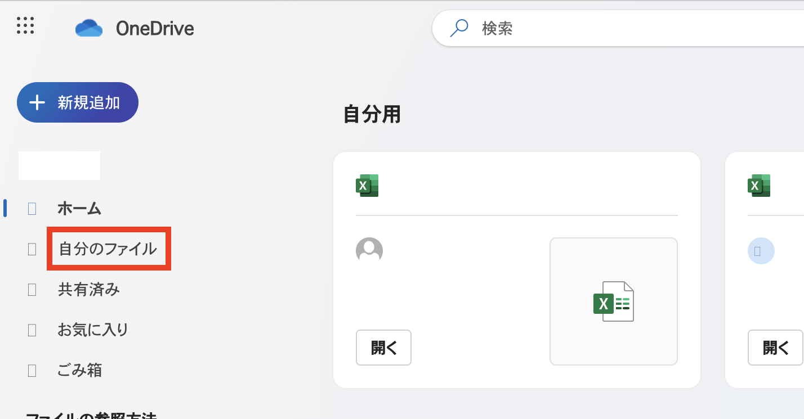
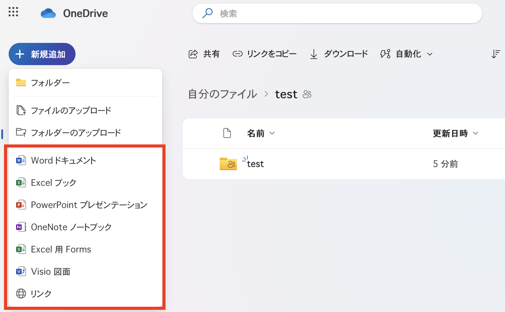
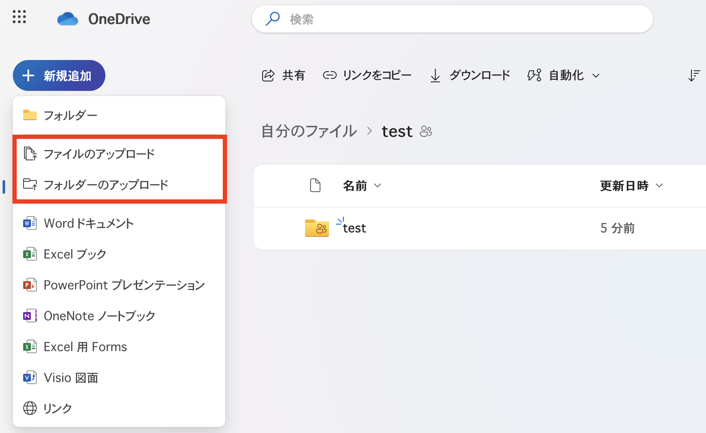
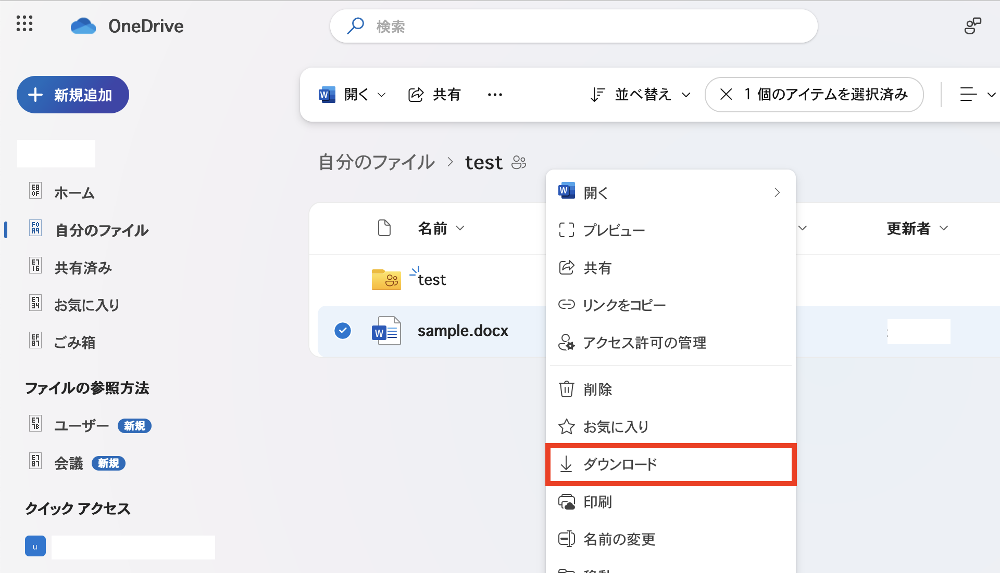
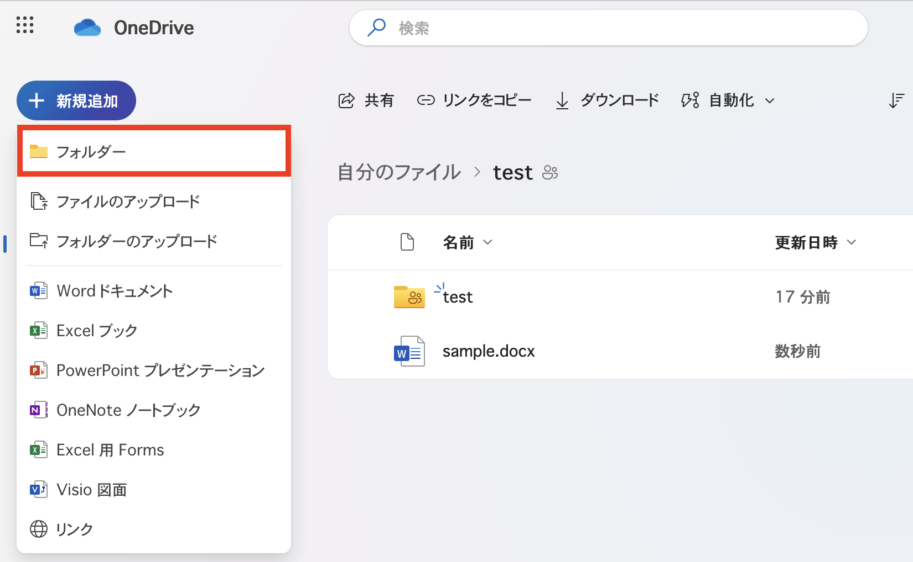
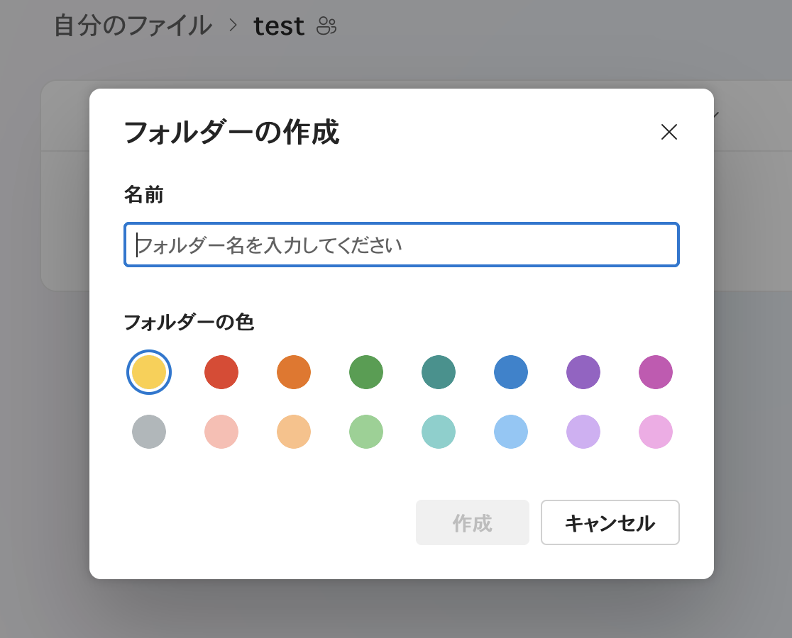
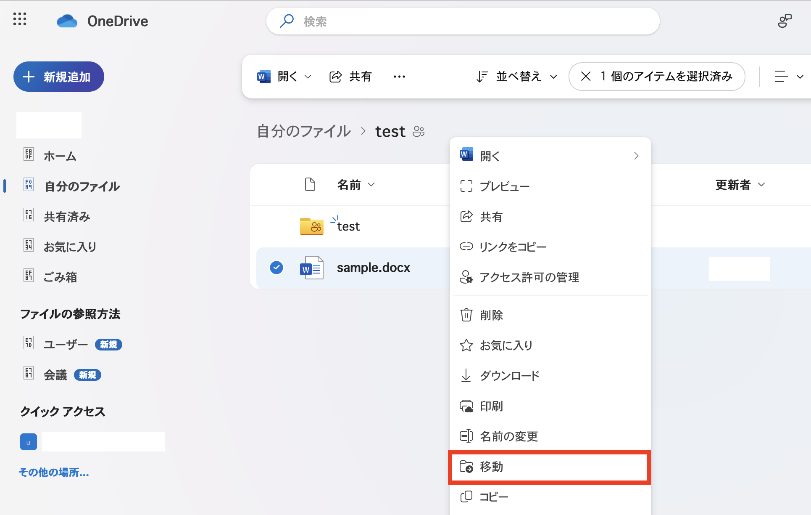
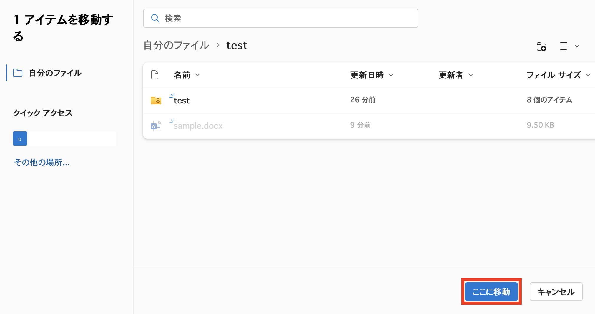

[OneDriveのページのトップに戻る](./)

## はじめに
このページでは，OneDriveに保存されたファイルを取り扱う際の具体的な操作手順について説明します．

なお，OneDriveの利用についての全般的な説明は「[OneDrive](.)」に，ファイルを共有する方法については「[OneDriveでファイルを共有する](share)」に記載されています．あわせて参照してください．

<!-- 以降の手順を行うには，あらかじめUTokyo AccountでMicrosoftにサインインし，ブラウザ上でOneDriveを開いている必要があります．この作業が完了していない場合には，[OneDriveのページの「ブラウザ上でOneDriveを開く」](/microsoft/onedrive/#signin)を参照してください． -->

## ファイルの場所に移動する
ここでは，OneDrive上に存在するファイルが置かれているフォルダに移動する方法を説明します．

OneDriveのトップページ（「ホーム」）には，OneDrive上に存在するファイルの一部がその置き場所に関わらず一覧表示されており，フォルダの階層構造を反映したものにはなっていません．そのため，フォルダ間を移動して目的のファイルにアクセスするには，以下のような手順に従う必要があります．

1. 画面左側のメニュー内の「自分のファイル」を押してください．
    - 「自分のファイル」は，OneDriveにおける最上位のフォルダに相当します．{:.medium.center}
1. 目的のファイルが存在するフォルダに移動してください．
    - 現在表示されているフォルダ内にあるフォルダに移動するには，対応するフォルダ名を押してください．
    - 現在表示されているフォルダの上の階層にあるフォルダに移動するには，画面上部のパンくずリストに表示されているフォルダ名を押してください．

## ファイルを作成する
ここでは，OneDrive上にファイルを作成する方法を説明します．

OneDriveで作成することのできるファイルの形式は，WordやExcelなどのOfficeアプリで用いられている標準的なものに限られます．作成可能なファイル形式は主に以下の通りです．

- Word 文書（拡張子 `.docx`）
- Excel ブック（拡張子 `.xlsx`）
- PowerPoint プレゼンテーション（拡張子 `.pptx`）

作成したファイルは，Web版のOfficeアプリを利用して編集することができます．

手順は次の通りです．

1. ファイルの作成場所となるフォルダに移動してください．
1. 画面上部の「新規追加」ボタンを押してください．{:.medium.center}
1. ファイル形式の一覧が表示されるので，作成したいファイル形式を選択してください．{:.medium.center}
1. ファイルが作成され，選択したファイル形式に対応するWeb版のOfficeアプリが新しいタブに表示されます．
    - 表示されたOfficeアプリを利用して，そのままファイルを編集することができます．

なお，Web版のOfficeアプリで作成されたファイルは，自動的にOneDrive上に保存されます．このことを利用して，OneDriveからではなく，Web版のOfficeアプリからファイルを作成することもできます．

## ファイルを編集する
ここでは，OneDrive上のファイルを編集する方法を説明します．

OneDriveに保存されているファイルのうち，WordやExcel等のOfficeアプリで開くことができるファイルは，Web版のOfficeアプリを利用して編集することができます．

1. 編集したいファイルが存在するフォルダに移動してください．
1. 編集したいファイルのファイル名を押してください．新しいタブにWeb版のOfficeアプリが表示され，ファイルを編集することができます．

## ファイルをアップロードする
ここでは，OneDriveにファイルをアップロードする方法を説明します．

1. ファイルをアップロードするフォルダに移動してください．
1. 画面上部の「新規追加」ボタンを押してください．{:.medium.center}
1. 単一のファイルをアップロードする場合は「ファイルのアップロード」，あるフォルダ内のファイルをまとめてアップロードする場合は「フォルダーのアップロード」を選択してください．{:.medium.center}
1. ファイルの選択画面が表示されるので，アップロードするファイルまたはフォルダを選択してください．
1. ファイルまたはフォルダがアップロードされます．

## ファイルをダウンロードする
ここでは，OneDrive上のファイルをダウンロードする方法を説明します．

1. ダウンロードしたいファイルが存在するフォルダに移動してください．
1. ダウンロードしたいファイルを右クリックし，「ダウンロード」を押してください．{:.medium.center}
    - 複数のファイルをまとめてダウンロードすることもできます．ダウンロードしたいファイルにカーソルを合わせ，アイコンの左側に表示されるチェックボックスをそれぞれオンにしてください．その後，画面上部の「ダウンロード」を押してください（「ダウンロード」ボタンが表示されない場合は，画面上部の3個の点が描かれたアイコンを押してください）．ファイルは`.zip`形式で圧縮された状態でダウンロードされます．
1. ファイルがダウンロードされます．その際，ダウンロード先のフォルダを選択する画面が表示される場合もあります．

## フォルダを作成する
ここでは，OneDrive上にフォルダを作成する方法を説明します．

1. フォルダの作成場所となるフォルダに移動してください．
1. 画面上部の「新規追加」ボタンを押し，「フォルダー」を選択してください．{:.medium.center}
1. 「フォルダーの作成」という画面が表示されるので，フォルダーの名前を入力してください．{:.medium.center}
1. 画面下部の「作成」を押してください．フォルダーが作成されます．

## ファイルを移動させる
ここでは，OneDrive上でファイルの置かれているフォルダーを変更する方法を説明します．

1. 移動させたいファイルを右クリックし，「移動」を押してください．{:.medium.center}
    - 複数のファイルをまとめて移動させることもできます．移動させたいファイルにカーソルを合わせ，アイコンの左側に表示されるチェックボックスをそれぞれオンにしてください．その後，画面上部の「移動」を押してください（「移動」ボタンが表示されない場合は，画面上部の3個の点が描かれたアイコンを押してください）．
1. フォルダの選択画面が表示されるので，画面上で，ファイルの移動先となるフォルダに移動してください．
1. 画面下部の「ここに移動」を押してください．選択したフォルダにファイルが移動されます．{:.medium.center}
