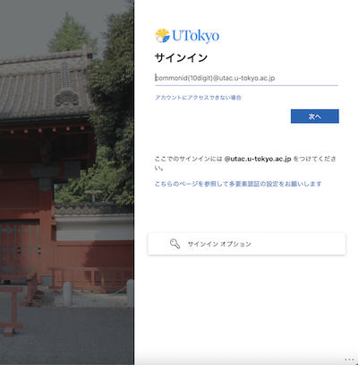
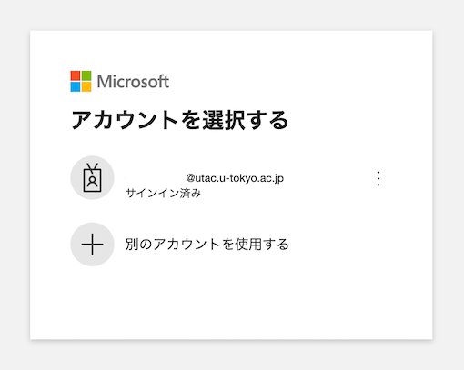

[UTokyo Microsoft Licenseのページのトップに戻る](.)

## はじめに
{:#about}

このページでは，UTokyo Accountを用いてMicrosoftの提供するシステムにサインインする方法を説明します．

東京大学では，UTokyo AccountでMicrosoftのシステムを利用することができる[UTokyo Microsoft License](/microsoft/)が提供されています．UTokyo AccountでMicrosoftのシステムを利用する際にサインインを要求する画面が表示された場合には，以下の「**[Microsoftのシステムにサインインする](#instruction)**」で説明する手順に従ってMicrosoftのシステムにサインインしてください．

また，UTokyo Accountではない別のMicrosoftアカウントですでにサインインをしていて，UTokyo Accountでの利用に切り替えたい場合は，「[別のMicrosoftアカウントでサインインしている場合にUTokyo Accountでの利用に切り替える](#switch_accounts)」を参照してください．これに関連して，同じブラウザで複数のMicrosoftアカウントを並行して利用する際に推奨される方法を「[一つのブラウザで複数のMicrosoftアカウントを使いわける](#multiple_accounts)」で説明しています．学生用と教職員用とで2つのUTokyo Accountをお持ちの方や，個人や他組織のMicrosoftアカウントと併用して利用したい方などはこちらもお読みください．

なお，UTokyo Microsoft Licenseについての全般的な説明や，利用可能なシステムの詳細は「[UTokyo Microsoft License](/microsoft/)」に記載されています．あわせて参照してください．

## Microsoftのシステムにサインインする
{:#instruction}

ここでは，Microsoftのシステムへのサインインを要求する画面が表示された場合に，UTokyo Accountを用いてサインインする方法を説明します．

UTokyo AccountでMicrosoftのシステムにサインインする際には，他のシステムにサインインする場合とは異なり，次のようにMicrosoftのロゴ等を含むサインイン画面が表示されることがあります．その場合には，次に示す手順に従ってサインインを行ってください．一方，下のような画面ではなく，通常のサインイン画面（安田講堂の画像が表示されているもの）が表示されている場合には，「[UTokyo Accountで情報システムにサインインする](/utokyo_account/#signin)」に従ってサインインを行ってください．

<figure class="gallery">{:.medium.center.border}{:.medium.center.border}{:.medium.center.border}</figure>

1. 表示されている画面を確認し，以下の手順を行ってください．
    - Microsoftまたは東京大学のロゴの下に**「サインイン」**と表示されている場合
        - 入力欄に「10桁の共通ID＋`@utac.u-tokyo.ac.jp`」を入力し，「次へ」を押してください．
    - Microsoftのロゴの下に**「アカウントを選択する」**と表示されている場合
        - 「10桁の共通ID＋`@utac.u-tokyo.ac.jp`」というアカウントが表示されている場合には，そのアカウントを選択してください．なお，アカウント名の下に「サインイン済み」と表示されている場合には，すでにUTokyo AccountでMicrosoftのシステムにサインインしています．このアカウントを選択することで，そのままMicrosoftのシステムを利用することができます．
        - 「10桁の共通ID＋`@utac.u-tokyo.ac.jp`」というアカウントが表示されていない場合には，「別のアカウントを使用する」を押し，入力欄に「10桁の共通ID＋`@utac.u-tokyo.ac.jp`」を入力してから「次へ」を押してください．
1. 「組織のサインイン ページに移動します。」というメッセージのあと，安田講堂の画像が表示されているサインイン画面へ自動的に移動します．以降は「[UTokyo Accountで情報システムにサインインする](/utokyo_account/#signin)」に従ってサインインを行ってください．
    

        
この手順がうまくいかないときのヘルプ

        - 「**有効な電子メール アドレス、電話番号、Skype 名を入力します。**」または「**そのユーザー名のアカウントが見つかりませんでした。別のユーザー名を入力するか、新しい Microsoft アカウントを取得してください。**」と表示された場合
            - 入力内容が間違っています．「10桁の共通ID＋`@utac.u-tokyo.ac.jp`」を正しく入力したかどうか確認してください．
        - 「**Microsoft アカウントが存在しません。別のアカウントを入力するか、新しいアカウントを作成してください。**」と表示された場合
            - このサインイン画面からは，UTokyo Accountでのサインインを行うことができません．UTokyo Accountでのサインインが可能なシステムであるにもかかわらずこの画面が表示されている場合は，[サポート窓口](/support/)に相談してください．
    

## 別のMicrosoftアカウントでサインインしている場合にUTokyo Accountでの利用に切り替える
{:#switch_accounts}

ここでは，別のMicrosoftアカウントですでにサインインをしている場合に，UTokyo AccountでMicrosoftのシステムにサインインする際の手順を説明します．

1. 利用しているMicrosoftのシステムの画面右上にある人型のアイコンを押してください．
    - アイコンの外観は利用しているシステムなどによって多少異なります．
1. プルダウンメニューが表示されるので，以下の手順に従ってください．
    - サインインしたいUTokyo Accountが表示されている場合
        - 表示されているアカウント名を選択し，画面の指示に従ってサインインを行ってください．状況により，安田講堂の画像があるサインイン画面が表示される場合や，多要素認証（MFA）の本人確認のみが要求される場合などがあります．サインイン手順の詳細は「[UTokyo Accountで情報システムにサインインする](/utokyo_account/#signin)」を参照してください．
    - サインインしたい UTokyo Account が表示されていない場合
        - 「別のアカウントでサインインする」を押してください．続いてMicrosoftのロゴがあるサインイン画面が表示されるので，「[Microsoftのシステムにサインインする](#instruction)」に従ってサインインしてください．
            

                
「別のアカウントでサインインする」が表示されていない場合

                「サインアウト」を押して現在サインインしているMicrosoftアカウントからサインアウトしたのち，UTokyo Accountで再びサインインしなおしてください．
            

以上の手順がうまくいかない場合には，以下の「[一つのブラウザで複数のMicrosoftアカウントを使いわける](#multiple_accounts)」に記載されている，「[シークレットブラウジング機能を利用する](#secret_browsing)」方法や「[複数のプロフィールを使用する](#profiles)」方法もお試しください．

## 一つのブラウザで複数の Microsoft アカウントを使いわける
{:#multiple_accounts}

学生用と教職員用とで2つのUTokyo Accountを付与されている場合やUTokyo Accountのほかに個人や他組織のMicrosoftアカウントを所有している場合などに同一のブラウザで複数のMicrosoftアカウントを並行して利用すると，アカウントの切り替えが正常に機能しないことがあります．

この問題を回避するためにアカウントごとに別のブラウザを使用することも可能ですが，ブラウザのシークレットブラウジング機能を利用したり複数のプロフィールを使用したりすることで，同一のブラウザで複数のMicrosoftアカウントを使い分けることができます．

### シークレットブラウジング機能を利用する
{:#secret_browsing}

一時的に別のMicrosoftアカウントを利用したい場合には，ブラウザのシークレットブラウジング機能を利用するのが便利です．

シークレットブラウジングとは，ブラウザに閲覧履歴などの情報を記憶させずにブラウザを利用することができる機能のことです．シークレットブラウジング機能を利用している間は，情報が記憶されないだけでなく，普段そのブラウザを利用している際に記憶された情報の影響を受けません．すなわち，シークレットブラウジングにおいては，ブラウザに記憶されたサインイン情報の影響を受けずにWebページを閲覧することができます．したがって，シークレットブラウジング機能を用いてMicrosoftアカウントにサインインすれば，いつもサインインしている別のMicrosoftアカウントの影響を受けずにMicrosoftのシステムを利用することができます．

なお，シークレットブラウジングを利用する方法が適しているのは，一時的に別のアカウントでサインインをしたい場合に限られます．これは，ブラウザのウィンドウを閉じてもサインインしたアカウントの情報は保持されないためです．Microsoftアカウントを使用する頻度が高く継続的に利用したい場合には，後述する「[複数のプロフィールを使用する](#profiles)」方法が便利です．

シークレットブラウジング機能の名称や利用手順はブラウザごとに異なります．詳細については，以下に記載されている各ブラウザの公式ドキュメントを参照してください．

- **Google Chrome**：[シークレットブラウジング](https://support.google.com/chrome/answer/95464?hl=ja)
- **Safari**：[MacのSafariでプライバシーを保護した形でブラウズする](https://support.apple.com/ja-jp/guide/safari/ibrw1069/mac)
- **Microsoft Edge**：[Microsoft Edge で InPrivate ブラウズを使う
](https://support.microsoft.com/ja-jp/microsoft-edge/microsoft-edge-%E3%81%A7-inprivate-%E3%83%96%E3%83%A9%E3%82%A6%E3%82%BA%E3%82%92%E4%BD%BF%E3%81%86-cd2c9a48-0bc4-b98e-5e46-ac40c84e27e2)
- **Firefox**：[プライベートブラウジング - 履歴を残さずに Firefox を使用する
](https://support.mozilla.org/ja/kb/private-browsing-use-firefox-without-history)

### 複数のプロフィールを使用する
{:#profiles}

継続的に別のMicrosoftアカウントを利用したい場合には，同一ブラウザ内で複数のプロフィールを使用するのが便利です．

プロフィールは，ブラウザに設定・記憶された情報（ブックマーク，履歴，パスワードなど）を複数並列に保持することができる機能です．複数のプロフィールを使用することでプロフィールごとに別のMicrosoftアカウントにサインインすることができる上，ウィンドウを閉じてもプロフィールごとのサインイン状態が維持されるので，継続的に別のMicrosoftアカウントを利用する場合に適しています．

プロフィールの作成手順はブラウザごとに異なります．詳細については，以下に記載されている各ブラウザの公式ドキュメントを参照してください．

- **Google Chrome**：[複数のプロフィールでChromeを使用する](https://support.google.com/chrome/answer/2364824?hl=ja)
- **Safari**：[MacのSafariでプロファイルを作成する](https://support.apple.com/ja-jp/guide/safari/ibrwf3a9e7d6/mac)
- **Microsoft Edge**：[Microsoft Edge でサインインして複数のプロファイルを作成する](https://support.microsoft.com/ja-jp/topic/df94e622-2061-49ae-ad1d-6f0e43ce6435)
- **Firefox**：[プロファイルマネージャーを使用して、Firefox のプロファイルを作成または削除する](https://support.mozilla.org/ja/kb/profile-manager-create-and-remove-firefox-profiles)

