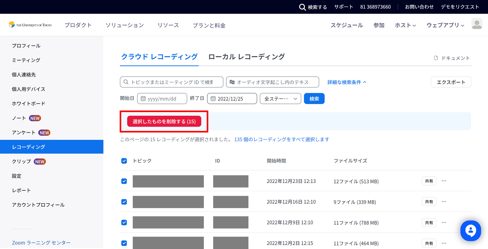
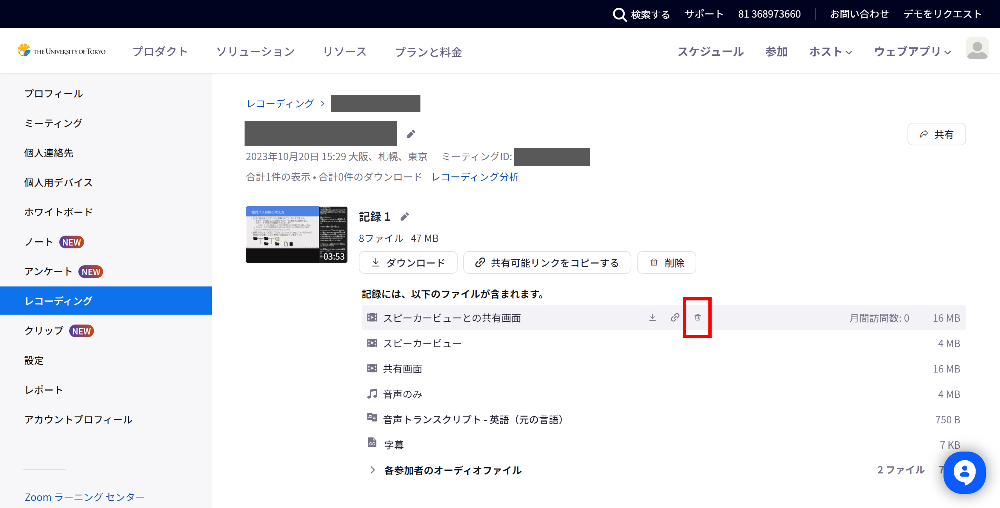

本学構成員の皆様におかれましては，Zoomをはじめとした本学の情報システムの運営にご協力いただき，いつもありがとうございます．

東京大学のZoomでは，2020年3月の提供開始から3年が経過し，**「クラウド録画」の使用容量が増加**しており，それに伴う費用負担が無視できなくなってきています．録画されたデータは無期限で保存されており，使用容量が今後も増加し続けることが予測されることから，このたび，持続的な運用にあたって使用容量を削減することが必要と判断しました．

保存されているクラウド録画の状況を調査したところ，使用容量のうち約5割は1回もアクセスされていないデータでした（下記図1）．また，1回以上アクセスされている録画について，そのうち約半数が録画後1週間以内・約8割が録画後2ヶ月以内にしかアクセスされておらず，録画から一定の期間が経過したものはアクセスされていない傾向にあることが分かりました（下記図2）．すなわち，**現在は不要となっているのに保存され続けているデータが多数ある**ことが推測されます．このことも踏まえ，強制的な制限を設けるような対応をすぐに取るのではなく，まずは構成員の皆様に不要な録画を削除していただくよう呼びかけることにしました．

つきましては，下の手順をご参照の上，**ご自身のアカウントに保存されているクラウド録画を定期的にご確認いただき，不要なデータは削除していただくようお願いいたします**．

また，保存し続ける必要のあるデータに関しても，ダウンロードした上でGoogleドライブ・YouTubeやOneDrive等にアップロードし，Zoom上のデータは削除する，といった対応ができないかご検討ください．加えて，Zoomには，録画を行ってから一定期間で自動的にデータが削除されるように設定する機能があります．クラウド録画を行う機会の多い方には，定期的に手動でデータを削除するのではなく，この設定を有効化することもおすすめです．これらの手順についても，詳細は下記をご覧ください．

お手数をおかけいたしますが，ご協力のほどどうぞよろしくお願いいたします．

## 手順について

### 保存されているクラウド録画を削除する手順

1. ブラウザでZoomの[レコーディング管理画面](https://u-tokyo-ac-jp.zoom.us/recording)にアクセスしてください．
1. クラウドレコーディングの一覧から，削除する録画を選び，チェックボックスにチェックを入れてください．
    - この際，画面上部の検索ボックスを利用すると，録画を探しやすく便利です．
    - 縦に並んで表示されているチェックボックスのうち一番上のものを選択すると，その下に並んでいるすべてのチェックボックスにチェックが入り便利です．
1. 削除対象の録画をすべて選択したら，「選択したものを削除する」ボタンを押してください．
    {:.medium.center}
1. 「クラウドレコーディングをゴミ箱に移動」と書かれた確認画面が表示されるので，「ゴミ箱に移動」ボタンを押してください．なお，削除の操作を実行した後しばらくは録画一覧画面に「削除中…」と表示されますが，しばらくすると消えますので無視してかまいません．
    {:.medium.center}

一方，ある1回のミーティングの録画の中で一部のファイルのみを削除することもできます．例えば，スピーカービューと共有画面を別々に録画している場合に，スピーカービューの録画のみを削除するような操作が可能です．

1. ブラウザでZoomの[レコーディング管理画面](https://u-tokyo-ac-jp.zoom.us/recording)にアクセスしてください．
1. レコーディングの一覧から，削除対象のファイルが含まれる録画を探し，ミーティングトピックを選択して詳細画面に移動してください．
1. 録画の詳細画面で削除対象のファイルにマウスポインタをかざし，ごみ箱のアイコンを選択してください．
    {:.medium.center}
1. 「このファイルをゴミ箱に移動」と書かれた確認画面が表示されるので，「ゴミ箱に移動」ボタンを押してください．
    {:.medium.center}

### Zoom以外の場所にデータを保存・共有する方法

東京大学で動画データをオンライン上で保存・共有できるシステムには，以下のものがあります．

- Googleドライブ
    - 使い方は「[Googleドライブ](/google/drive/)」のページをご覧ください．
    - 保存容量は1人あたり100GBまでです．利用負担金を支払って容量を増やすこともできます．
- YouTube
    - 使い方は[YouTubeヘルプ「YouTube 動画をアップロードする」](https://support.google.com/youtube/answer/57407?hl=ja)をご覧ください．また，[YouTubeのコンテンツを学内構成員限定で公開する](https://www.sodan.ecc.u-tokyo.ac.jp/hack/youtube-utokyo-only/)こともできます．
    - [15分を超える動画のアップロード](https://support.google.com/youtube/answer/71673?hl=ja)には「アカウントの確認」と呼ばれる手続きが必要です．また，アカウントの確認が済んでも，1つのファイルで256GBまたは12時間を超えるような動画はアップロードできません．現在のところ，アップロードできる動画の数や合計サイズには上限がありません．
- OneDrive
    - 使い方は「[OneDrive](/microsoft/onedrive/)」のページをご覧ください．
    - 保存容量については，Microsoft社による容量制限が予定されているため，設定変更を行って1人あたり50GB程度とする計画です．詳細は近日中に別途お知らせいたします．

### 録画を行ってから一定期間で自動的にデータが削除されるように設定する手順

1. ブラウザでZoomの[設定管理画面](https://u-tokyo-ac-jp.zoom.us/profile/setting)にアクセスし，「レコーディング」タブを開いてください．
1. 「指定された日数が経過した後、クラウド レコーディングを削除します」という設定項目を探し，トグルを選択して有効にしてください．すると，録画後何日で自動的に削除するかを設定する欄が表示されるので，適当な日数を入力して「保存」を押してください．
    {:.medium.center}

## クラウド録画の使用状況の調査結果

<figure>
    
    <figcaption class="center">図1：Zoomクラウド録画のアクセス履歴の有無（録画時期別）</figcaption>
</figure>

<figure>
    
    <figcaption class="center">図2：Zoomクラウド録画における録画から最終アクセスまでの期間の分布</figcaption>
</figure>
