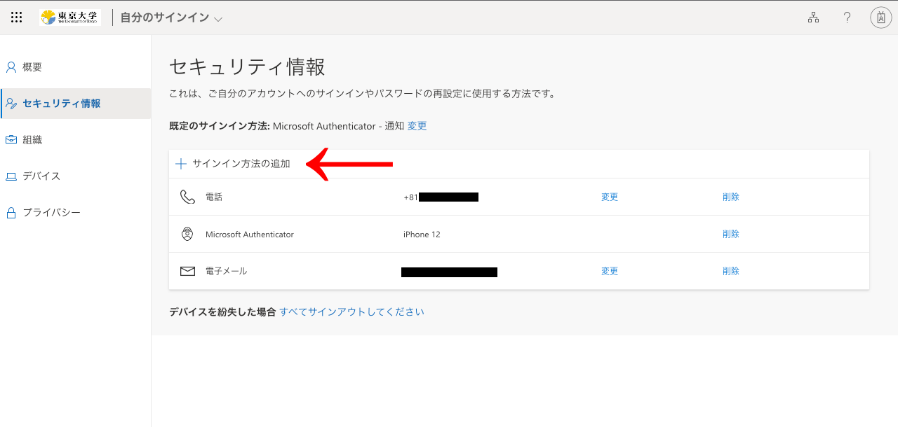
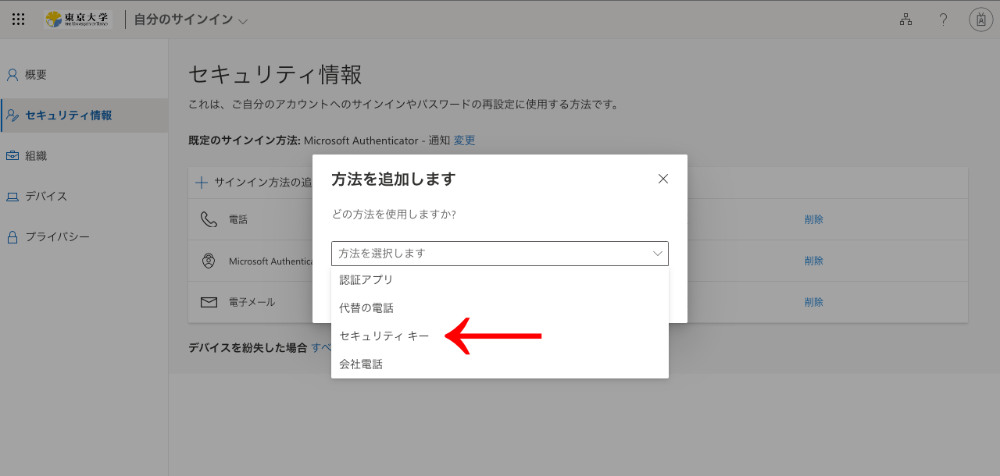
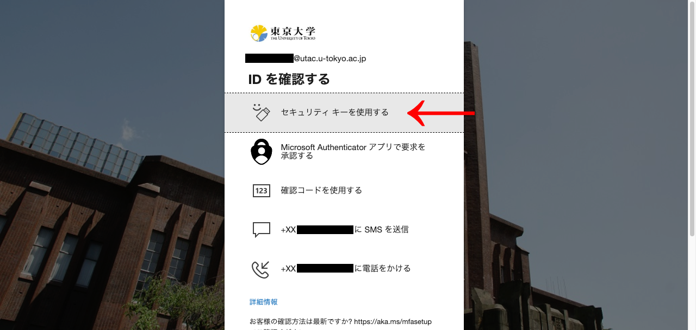

2023年5月16日から，UTokyo Accountの多要素認証でFIDOセキュリティキーを利用できるようになりました．

## はじめに

このページでは，UTokyo Accountの多要素認証にFIDOセキュリティキーを利用する方法について，注意事項や登録方法，利用方法について説明しています．FIDO（Fast IDentity Online）とは，オンラインサービスでのサインインのセキュリティ向上のために普及が進められている新しい技術の一つであり，パスワードやPINのような秘密情報をサーバーと共有せずにサインインを行うため情報漏洩のリスクが低く，ブラウザ以外にアプリなどを必要とせずスムーズに操作できる点で利便性が高いサインイン方法です．

なお，FIDOはセキュリティキーと呼ばれる専用の機器を用いる方法とパソコンやスマホに保存された情報を用いるパスキーという方法の2種類に大別されますが，UTokyo Accountの多要素認証では，現時点ではFIDOにパスキーは利用できず，YubiKeyなどのセキュリティキーのみが利用可能ですので，セキュリティキーを自身で購入してご利用ください．その際，利用可能なセキュリティキーは「FIDO 2」規格に対応したセキュリティキーとなりますので，注意してください．

## 注意事項

### 一部のシステムでは対応していません
{:#unsupported-system}

UTokyo Accountの多要素認証では，多くのシステムでFIDOに対応してますが，一部のシステムではFIDOに対応していません．そのため，FIDO以外の本人確認方法を登録した上で，FIDOは2個目以降の本人確認方法として利用してください．UTokyo Accountで利用できる各システムについて，FIDOに対応しているかどうかについての情報は，[UTokyo Account Service Directory](https://login.adm.u-tokyo.ac.jp/utokyoaccount/)を参照してください．

「YubiKey」という製品の一部のモデルでは，FIDOに加え，「Yubico Authenticator」というアプリと連携し，Yubikeyを接続した端末上のアプリに表示されるコード（6桁の数字）を入力するTOTP（Time-based One-Time Password）という本人確認方法も使えるため，便利です．YubiKeyで「Yubico Authenticator」アプリを使用する方法についての詳細は「[UTokyo Account多要素認証におけるYubico Authenticatorアプリの利用方法](yubikey-totp)」のページを参照してください．

### 一部のOS・ブラウザでは使えません
{:#unsupported-os-browser}

FIDOは，iOSのSafariやAndroidのGoogle Chrome，macOSのSafariなど一部のOSとブラウザの組み合わせでは利用できません．2023年5月時点で利用できるOSとブラウザの組み合わせは，以下の通りです．

- Windows - Google Chrome
- Windows - Microsoft Edge
- Windows - Firefox
- macOS - Google Chrome
- macOS - Microsoft Edge
- ChromeOS - Google Chrome
- Linux - Google Chrome

利用できるOSとブラウザの組み合わせについての詳細は，Microsoft社の「[サポートされているブラウザ](https://learn.microsoft.com/ja-jp/azure/active-directory/authentication/fido2-compatibility#supported-browsers)」のページを参照してください．

## FIDOセキュリティキーの登録手順

FIDOセキュリティキーは，2個目以降の本人確認方法として登録することを前提としています．多要素認証を初めて利用する方は，[[「UTokyo Account多要素認証の初期設定手順」の中の「手順1：1個目の本人確認方法を登録する」](/utokyo_account/mfa/initial#first)の手順に従って1個目の本人確認方法を登録してから，追加の本人確認方法としてFIDOセキュリティキーを登録してください．

1. [多要素認証の設定ページ](https://mysignins.microsoft.com/security-info)にアクセスし，サインインしてください．
2. 「サインイン方法の追加」を押してください．

3. 「方法を選択します」を押して，現れる選択肢から「セキュリティキー」を押し，「追加」を押してください．

4. セキュリティキーの接続方法として，「USBデバイス」または「NFCデバイス」を選択するよう求められるので，該当する方のボタンを押してください．

5. 「キーの用意をしてください」という画面が表示されるので，「次へ」を押してください．

6. 画面の指示に従って，セキュリティキーの設定を完了してください．具体的には，セキュリティキーの接続や，PINあるいは生体認証の設定，セキュリティキーのタップなどが求められます．
7. セキュリティキーの設定が完了したら，セキュリティキーに名前を付けてください．

※FIDOセキュリティキーは「既定のサインイン方法」には設定できないため，別の本人確認方法を「既定のサインイン方法」に設定した上で，サインイン時に別の本人確認方法としてセキュリティキーを選択する必要があります．

## FIDOセキュリティキーでのサインイン方法

1. UTokyo Accountでサインイン時（パスワード入力後）にデフォルトの本人確認方法で多要素認証の本人確認を行う画面が表示されますが，その画面で「問題がありますか? 別の方法でサインインする」あるいは「Microsoft Authenticator アプリを現在使用できません」というリンクを押してください．

2. 別の本人確認方法を選択する画面が表示されるので，「セキュリティ キーを使用する」を押してください．

3. 画面の指示に従って，PINの入力あるいは生体認証，セキュリティキーのタップなどを行った後，サインインが完了します．

※サインインがうまくいかない場合は，下の[FIDOセキュリティキーを利用したサインインができない場合](#troubleshooting)を参照してください．

## FIDOセキュリティキーを利用したサインインができない場合
{:#troubleshooting}

### セキュリティキーが選択肢に現れない場合

FIDOに対応していないシステムのため，別の本人確認方法を利用してください．詳細は，「[一部のシステムでは対応していません](#unsupported-system)」の節を参照してください．

### 「セキュリティ上の理由により，アカウントを検証するための追加情報が必要です」と表示される場合

FIDOに対応していないシステムでは，FIDOセキュリティキー以外の本人確認方法が登録されていない場合，このメッセージが表示されます．5秒後に多要素認証の設定ページに切り替わるため，[「UTokyo Account多要素認証の初期設定手順」の中の「手順2：追加の本人確認方法を登録する」](/utokyo_account/mfa/initial#alternative)の手順に従って，FIDO以外の本人確認方法を登録してください．FIDOが対応していないシステムの詳細は，「[一部のシステムでは対応していません](#unsupported-system)」の節を参照してください．

### 「セキュリティキーを使用する」を押してから先に進まない場合

FIDOが使えないOS・ブラウザの組み合わせである可能性があります．詳細は，「[一部のOS・ブラウザでは使えません](#unsupported-os-browser)」の節を参照してください．
