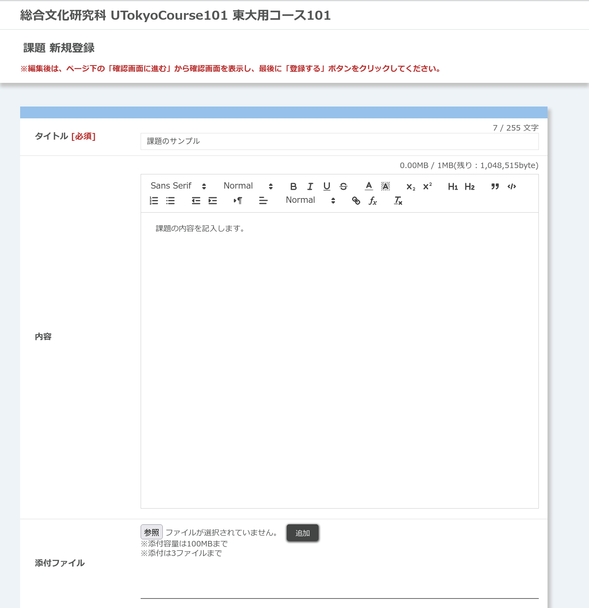
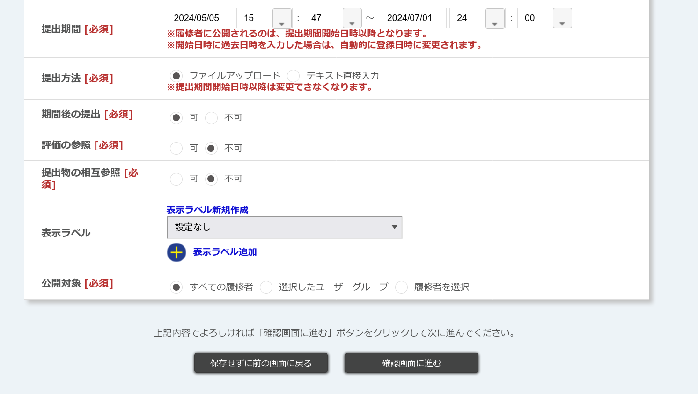
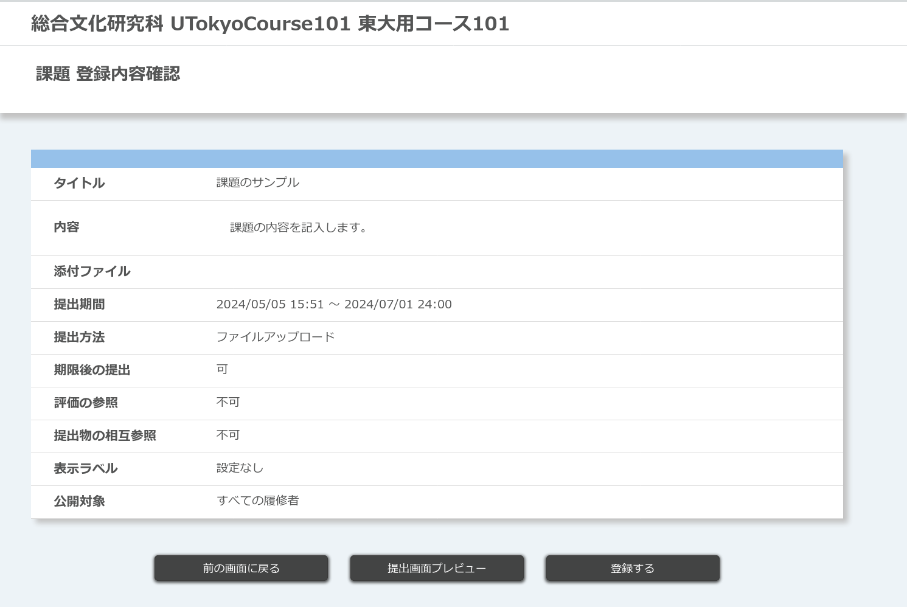
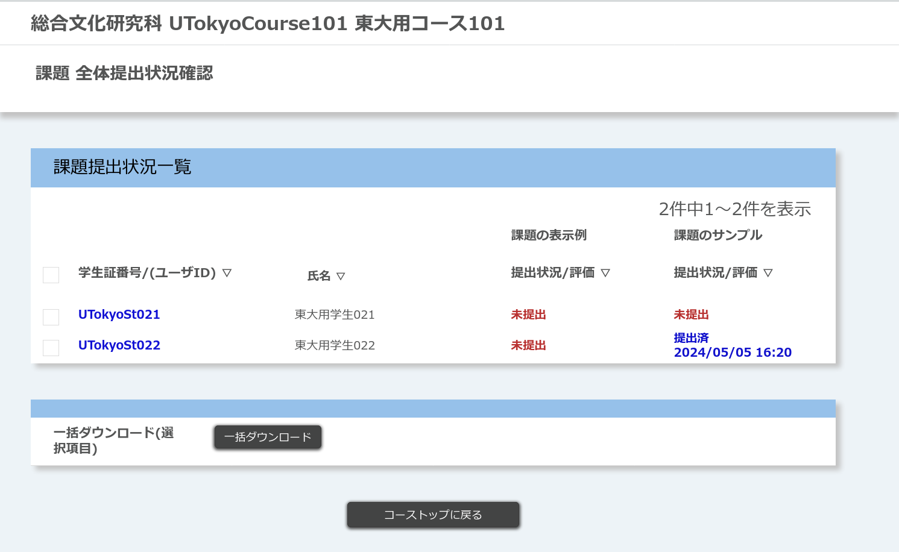
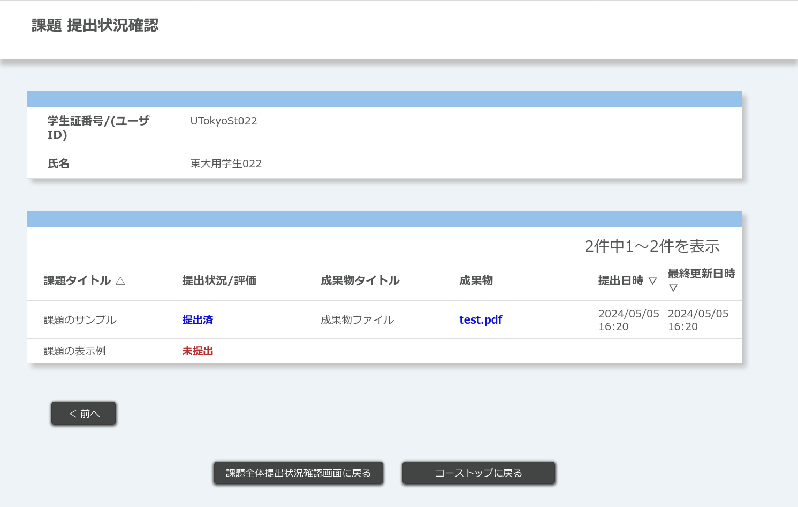
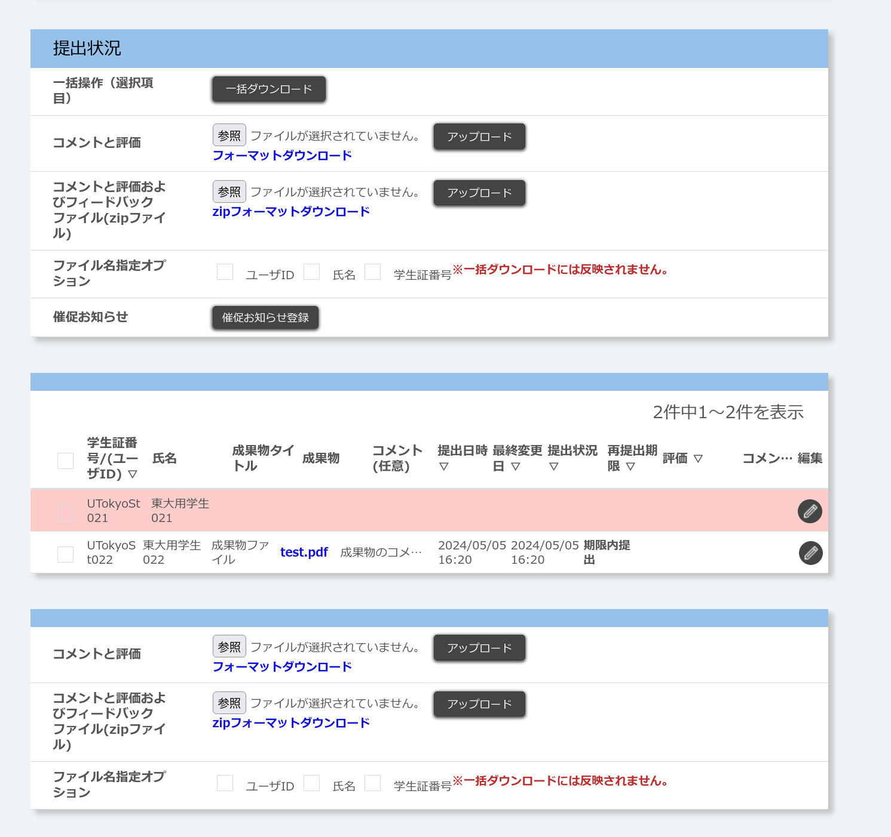
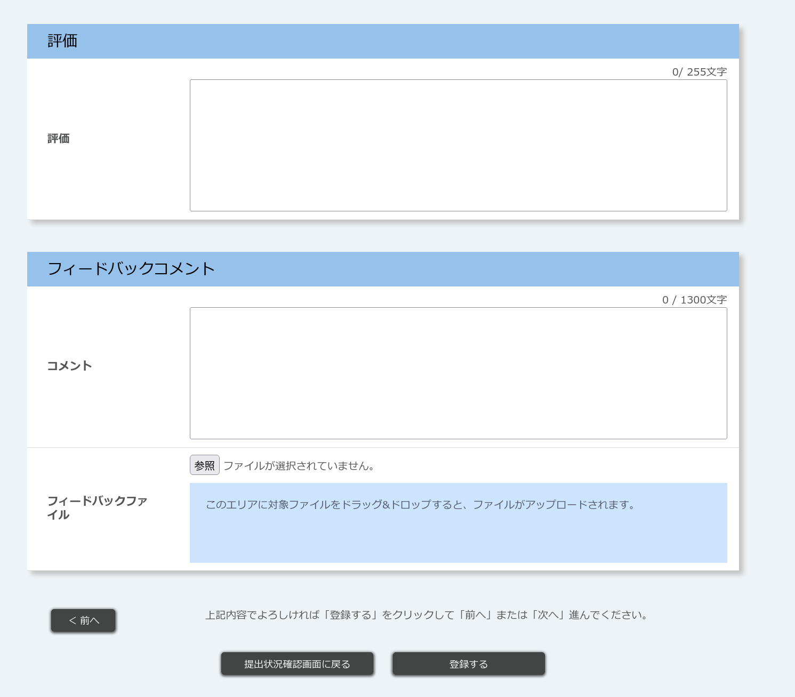

---
title: UTOLで課題機能を利用する（教員・TA向け）
redirect_from:
  - /lms_lecturers/assignments
  - /itc_lms/lecturers/assignments
breadcrumb:
  title: 課題
---

## 概要

課題機能は，UTOL上で履修者に課題を課し，提出された課題を評価できる機能です．課題には期限日時を設定でき，提出日時も記録されます．また，期限後の提出の可否の設定や，提出物を履修者同士で閲覧できるようにする設定も可能です．

課題には「テキスト直接入力」と「ファイルアップロード」の二つの形式があります．

- テキスト直接入力
  - 履修者は，UTOL上でテキストを直接入力して課題を提出します．
  - 授業コメントやリアクションペーパーなど，短い文章の課題に適します．
- ファイルアップロード
  - 履修者は，自身の端末から成果物（PDFファイルなど）をアップロードして課題を提出します．
  - レポートや発表用スライドなど，一定以上の分量・構造をもつ課題，ないしテキスト以外の内容を含む課題に適します．
  - ファイルサイズの上限は100MBです．

以下では，「課題の管理」「課題の提出状況確認」「課題の評価」の三点に分けて説明します．このうち，「課題の提出状況確認」は二通りの確認方法（「すべての課題の提出状況を確認する」「個別の課題の提出状況を確認する」）に分かれます．

なお，担当教員・TA・コース設計者が課題を管理できます．ただし，課題の評価を行えるのは担当教員・TAのみです．

## 課題の管理

ここでは，課題の管理（登録・編集・削除）の手順を説明します．

### 課題の設定項目
{:#setting-entries}

まず，以下で課題に対して行える設定項目の一覧を示します（二枚の画像に分けて説明します）．

{:.center}

- 「タイトル」（記入必須）
  - 例：「第1回講義コメント」「期末レポート」
- 「内容」
  - 課題の説明を記入します．
- 「添付ファイル」
  - 課題の参考になるファイルなどを添付できます．
  - 最大100MBのファイルを，3つまで添付できます．

{:.center}

- 「提出期間」（設定必須）
  - 例：授業開始時から次回授業の開始時まで
  - いますぐ提出を開始させてよい場合，提出開始時間の設定は変更せず，そのままにしてください．
- 「提出方法」（選択必須）
  - 課題の提出方法（「ファイルアップロード」，「テキスト直接入力」）を選択します．
- 「期間後の提出」（選択必須）
  - 履修者が提出期限後に課題を提出できるかどうかを指定します．
  - 提出期限前後にUTOLに負荷が集中し，提出に失敗するなどのトラブルの可能性もあるため，「可」に設定したほうが安全です．
  - 期間内に提出されたかどうかは後から確認できるので，期間外提出の場合には受理しつつ減点する，などの対応を取ることもできます．
- 「評価の参照」
  - 課題につけた評価を，履修者が閲覧できるかどうかを指定します．
    - 関連：
      - [課題を評価する](#evaluate)
- 「提出物の相互参照」
  - 履修者同士が互いの提出物を参照できるかを指定します．
  - たとえば履修者が授業内で発表を行う場合，課題として提出されたレジュメやスライドを他の履修者が参照できたほうが，スムーズに授業を進められることもあります．
- 「表示ラベル」
- 課題にも教材やテストと共通のラベルを付与できます．
- 新しくラベルを作成する場合，「表示ラベル新規作成」ボタンを押してください．
- すでに作成済みのラベルを使う場合，ドロップダウンメニューからラベルを選択し，「表示ラベル追加」を押すと，追加できます．
- 関連：
  - [UTOLでコース設定を行う（教員・TA向け） - ラベル](/utol/lecturers/settings/#label)
- 「公開対象」
- 課題の公開対象を選択します．以下の三種類から選択できます．
  - 「すべての履修者」
  - 「選択したユーザグループ」
    - 事前に作成したユーザグループを対象に公開できます．
    - 関連：
      - [UTOLでユーザグループ機能を利用する（教員・TA向け）](/utol/lecturers/settings/user_groups/)
  - グループ名をクリックすると，グループに所属する履修者を確認できます．
  - 「履修者を選択」
  - 特定の履修者を選んで公開できます．
  - 履修者一覧が表示されるので，公開したい履修者にチェックを入れます．

### 課題の登録手順
{:#register}

1. 「コーストップ」画面を開き，「課題」欄の左下にある {:.icon} ボタンを押します．
   {:.center}
2. 「課題 新規登録」のページが開くので，上記の[課題の設定項目](#setting-entries)を記入してください．
3. 記入を終えたら，「確認画面に進む」ボタンを押します．
4. 「課題 登録内容確認」のページが開くので，内容を確認してください．
   - 「提出期間」「提出方法」「期間後の提出」の設定などは特に注意が必要です．
   - 「提出画面プレビュー」ボタンを押すと，履修者が課題を閲覧した際にどのように表示されるかを確認できます．
     {:.center}
5. 確認を終えたら，「登録する」ボタンを押します．

### 課題の編集手順

1. コーストップを開き，「課題」欄のうち，編集したい課題名をクリックします．
   {:.center}
2. 編集画面が開くので，[課題の登録手順](#register)と同様に内容を編集します．

### 課題の削除手順

1. コーストップを開き，「課題」欄のうち，削除したい課題名の右，「操作」の列にある {:.icon} ボタンを押します．
   {:.center}
2. 「削除」ボタンをクリックします．
3. 「（課題名）を削除して宜しいですか？」と確認されるので，「削除」を押します．

## すべての課題の提出状況を確認する

ここでは，授業全体を通じた，すべての課題の提出状況を確認する手順を説明します．

1. コーストップを開き，「課題」の左下にある「全履修者の提出物確認」ボタンを押します．
   {:.center}
2. 「課題 全体提出状況確認」の画面が開くので，以下の二通りの確認方法に応じて操作します．
   - すべての履修者について確認
   - 履修者ごとに確認

### すべての履修者について確認

この時点で，すべての課題の提出状況を，すべての履修者について示した一覧表が表示されています（以下，「一覧表」と呼称します）．

{:.center}

#### 並べ替えて表示

1. 一覧表の列の見出し（「学生証番号/(ユーザID)」，「氏名」など）をクリックすると，それぞれの項目ごとに昇順・降順が切り替わります．

#### 提出状況のダウンロード

提出状況をExcelファイル形式でダウンロードすることもできます（ただし，ファイルにはパスワードの設定が必須です）．

1. 一覧表のうち，提出状況を知りたい履修者のチェックボックスを選択します．
   - 全員選択：「学生証番号/(ユーザID)」という見出しの左にあるチェックボックス
   - 個別の履修者を選択：当該履修者の学生証番号の左にあるチェックボックス
2. 「一括ダウンロード」ボタンを押します．
3. Excelファイルのパスワードを設定するよう求められるので，パスワードを入力し，もう一度「ダウンロード」ボタンを押してください．
4. Excelファイル（`.xlsx` 形式）を含むZIPファイル（`.zip` 形式）がダウンロードされます．

#### 課題の評価画面へ移動
{:#go-to-evaluate-1}

1. 「提出状況/評価」の列にて，それぞれの提出物（青字）をクリックすると，[UTOL上で課題を評価する](#evaluate-on-utol)画面へ遷移します．

### 履修者ごとに確認

さらに絞り込んで，すべての課題の提出状況を，履修者ごとに確認することもできます．

1. 「課題 全体提出状況確認」の画面で，対象の履修者の「学生証番号/(ユーザID)」（青文字）をクリックします．
2. 「課題 提出状況確認」の画面が開き，履修者ごとの全課題の提出状況が表示されます．

{:.center}

#### 履修者間の移動

1. 画面左下の「前へ」ボタン，または右下の「次へ」ボタンを押すと，前／次の履修者に移動できます．

#### 課題の評価画面へ移動
{:#go-to-evaluate-2}

1. 「提出状況/評価」の列にて，それぞれの提出物（青字）をクリックすると，[UTOL上で課題を評価する](#evaluate-on-utol)画面へ遷移します．

## 個別の課題の提出状況を確認する
{:#submission-status-per-assignment}

ここでは，個別の課題について，全履修者の提出状況を確認する手順を説明します．

1. コーストップを開き，「課題」の欄のうち，確認したい課題名の右，「操作」の列にある {:.icon} ボタンを押します．
   {:.center}
2. 「提出状況確認」を選択します．
3. 「課題 提出状況確認」の画面が開き，「提出状況」の欄，および全員の提出状況の一覧表が表示されます．（スクリーンショット）

{:.center}

### 提出状況のダウンロード

提出状況をExcelファイル形式でダウンロードすることもできます（ただし，ファイルにはパスワードの設定が必須です）．

1. 一覧表のうち，提出状況を知りたい履修者のチェックボックスを選択します．
   - 全員選択：「学生証番号/(ユーザID)」という見出しの左にあるチェックボックス
   - 個別の履修者を選択：当該履修者の学生証番号の左にあるチェックボックス
2. 「提出状況」の欄のうち，「一括操作（選択項目）」の「一括ダウンロード」ボタンを押します．
3. Excelファイルのパスワードを設定するよう求められるので，パスワードを入力し，もう一度「ダウンロード」ボタンを押してください．
4. Excelファイル（`.xlsx` 形式）を含むZIPファイル（`.zip` 形式）がダウンロードされます．

### 課題の評価画面へ移動
{:#go-to-evaluate-3}

1. 一覧表のうち，評価したい履修者の行の右端，「編集」の列にある {:.icon} ボタンを押すと，[UTOL上で課題を評価する](#evaluate-on-utol)画面へ遷移します．

## 課題を評価する
{:#evaluate}

ここでは，課題を評価する手順を説明します．

評価には以下の二種類があり，いずれの要素も任意です．

- 「評価」
  - 課題に対する簡潔な評価です．
  - テキスト形式で，最大255文字まで記載できます．
- 「フィードバックコメント」
  - 「コメント」および「フィードバックファイル」から構成されます．
  - 「コメント」
    - 課題に対する詳細なフィードバックです．
    - テキスト形式で，最大1300文字まで記載できます．
  - 「フィードバックファイル」
    - テキスト以外の形式でのフィードバックです．
      - 例：指摘点をまとめたPDFファイル

さらに，評価を行う作業手順として，「UTOL上で評価」または「フォーマットをダウンロードして評価」の二通りの手順があります．両者の比較は以下の通りです．

- 「UTOL上で評価」
  - UTOL上の操作によって評価作業を行います．
  - ブラウザ上ですべての作業が完結するため，簡単です．ただし，履修者一人ごとに評価を行う必要があります．
- 「フォーマットをダウンロードして評価」
  - Excelファイル（`.xlsx` 形式）またはZIPファイル（`.zip` 形式）のフォーマットファイルをダウンロードし，そこに評価を記入します．記入後，ファイルをアップロードするとUTOLがそれを読み取り，評価が反映されます．
  - 全履修者を一括で評価できるため，履修者が多い場合などに便利です．ただし，作業に慣れが必要です．
  - なお，ダウンロードしたフォーマットファイルにはパスワードの設定が必須となります．

### UTOL上で評価
{:#evaluate-on-utol}

1. 以下のいずれかの方法で，課題の評価画面に移動します．
   - 「すべての課題の提出状況を確認する」のうち
     - [「すべての履修者について確認」から遷移する場合](#go-to-evaluate-1)
     - [「履修者ごとに確認」から遷移する場合](#go-to-evaluate-2)
   - [「個別の課題の提出状況を確認する」から遷移する場合](#go-to-evaluate-3)
2. 「課題 フィードバック登録/編集」の画面が開くので，「評価」「フィードバックコメント」「フィードバックファイル」を追加し，「登録する」を押します．
   {:.center}
3. 画面左下の「前へ」ボタン，または右下の「次へ」ボタンを押すと，前／次の履修者の評価に移れます．

### フォーマットをダウンロードして評価

1. [「個別の課題の提出状況を確認する」画面](#submission-status-per-assignment)を開きます．
2. 「提出状況」の欄からフォーマットをダウンロードします．「フィードバックファイル」の添付の有無に応じて，ダウンロードするファイルが異なります．

- 「フィードバックファイル」が不要の（「評価」と「フィードバックコメント」いずれもテキストのみでよい）場合
  1. 「コメントと評価」の行にある，「フォーマットダウンロード」ボタン（青字）をクリックします．
  2. Excelファイルのパスワードを設定するよう求められるので，パスワードを入力し，もう一度「ダウンロード」ボタンを押してください．
  3. Excelファイル（`.xlsx` 形式）のフォーマットがダウンロードされます．
- 「フィードバックファイル」を添付したい場合
  1. 「コメントと評価およびフィードバックファイル(zipファイル)」の行にある，「zipフォーマットダウンロード」ボタン（青字）をクリックします．
  2. ZIPファイルのパスワードを設定するよう求められるので，パスワードを入力し，もう一度「ダウンロード」ボタンを押してください．
  3. ZIPファイル（`.zip` 形式）のフォーマットがダウンロードされます．

ダウンロードしたフォーマットの形式に応じて，以下の手順で評価を記入・アップロードします．

#### Excelファイルの場合

1. ダウンロードしたExcelファイル（`.xlsx` 形式）を開きます．
2. 「評価」「コメント」の項目を記入し，保存します．
   - このとき，ファイル名は変更しないでください．
3. [「個別の課題の提出状況を確認する」画面](#submission-status-per-assignment)に戻ります．
4. 「提出状況」の欄のうち，「コメントと評価」の行にある「参照」ボタンを押し，先ほど記入したExcelファイルを選択します．
5. 「アップロード」ボタンを押します．

#### ZIPファイルの場合

1. ダウンロードしたZIPファイル（`.zip` 形式）を解凍し，解凍先のフォルダ内にあるExcelファイル（`.xlsx` 形式）を開きます．
2. 「評価」「コメント」の項目を記入し，保存します．
   - このとき，ファイル名は変更しないでください．
3. フィードバックファイルを，解凍先のフォルダ内にある「フィードバック」フォルダの中に入れ，そのファイル名を「ファイル」の欄に記入します．
   - 例：履修者Aへのフィードバックファイルが 「`フィードバック_A.pdf`」だった場合，「`フィードバック_A.pdf`」を「フィードバック」フォルダに入れ，履修者Aの行の「ファイル」欄に「`フィードバック_A.pdf`」と記入
4. すべての記入を終えたら，お使いのOSのファイルマネージャ（Windowsであれば「エクスプローラー」，Macであれば「Finder」）を開き，解凍先のフォルダ内にあるすべてのファイル・フォルダを選択します．
5. 選択したファイルを再び圧縮し，ZIPファイルを作成します．
   - 解凍・圧縮にあたっては，OSのファイルマネージャ付属の標準ツールを利用してください．それ以外の方法（例：7-Zip）で作成したZIPファイルを使用した場合，エラーが発生してUTOLの処理が停止することがあります．
6. [「個別の課題の提出状況を確認する」画面](#submission-status-per-assignment)に戻ります．
7. 「提出状況」の欄のうち，「コメントと評価およびフィードバックファイル(zipファイル)」の行にある「参照」ボタンを押し，先ほど圧縮したZIPファイルを選択します．
8. 「アップロード」ボタンを押します．

## 参考情報

- 関連ページの一覧
  - [UTOLでコース設定を行う（教員・TA向け） - ラベル](/utol/lecturers/settings/#label)
  - [UTOLでユーザグループ機能を利用する（教員・TA向け）](/utol/lecturers/settings/user_groups/)
