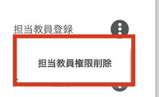
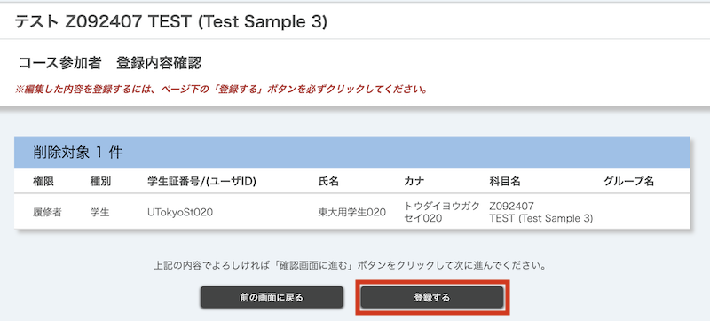

## 機能概要
{:#about}

「コース参加者登録」機能では，コース参加者（担当教員・TA・コース設計者・履修者といった，UTOL上でコースに参加しているユーザ）の管理を行うことができます．

具体的には以下のような操作が可能です．
- [コース参加者の一覧・登録方法を確認する](#list)
- [科目を共同で担当する（UTASに登録されていない）教員やTAをコースに登録する](#register)
- [受講登録していない学生をコースに登録する](#register)
- [コース参加者の登録方法を更新する](#update)
- [コース参加者を削除する](#delete)

### 権限
{:#role}

担当教員・コース設計者は，このページで説明しているすべての操作を行うことができます．TAは，コース参加者一覧の閲覧のみが可能で，コース参加者の登録・削除はできません．

## コース参加者の情報を確認する
{:#list}

「コース参加者登録」のページの「コース参加者一覧」欄では，コース参加者の情報を一覧形式で確認することができます．また，これらの情報をExcelファイルとしてダウンロードすることも可能です．

### 一覧で確認できる情報
{:#information}

「コース参加者一覧」欄では，以下の情報を確認できます．

- **権限**：ユーザが「担当教員」「TA」「コース設計者」「履修者」の4種類の権限のうち，どの権限を持っているかが表示されます．TAと履修者の両方の権限を持つユーザの場合は「TA兼履修者」と表示されます．
- **種別**：ユーザのUTokyo Accountが，学生用，教職員用のいずれであるかが表示されます．教職員用かつ学生用のUTokyo Accountを持っている場合は，「学生/教職員」と表示されます．ここでの表示は，コースに「学生」として参加しているか「教職員」として参加しているかではないことに注意してください．
- **学生証番号/(ユーザID)**：学生証番号を持つユーザの場合は，学生証番号が表示されます．学生証番号を持たないユーザの場合は，ユーザID（UTokyo Accountでログインしているユーザの場合は，10桁の共通ID）が表示されます．
- **科目名**：履修者が受講登録をしている科目名が表示されます．[コースグループ機能](../course_group/)が使われている場合，学生が受講登録をしている科目をこの欄で確認できます．
- **グループ名**：[ユーザグループ](../user_groups/)に所属している場合，所属しているグループ名が表示されます．複数のユーザグループに所属している場合は全てが表示されています．
- **登録方法**：ユーザがコースに登録された方法が表示されます．登録方法には以下の種類があります．
    - 自己登録：履修者本人がUTOL上で[受講登録](../../../students/course_registration/#self-registration)をしたことを示します．なお，履修者本人による受講登録が可能かは，[自己登録・履修者範囲設定](../#self-registration-and-content-use-scope)の設定により異なります．
    - 担当教員登録：ユーザが，担当教員またはコース設計者により，コース参加者として登録されたことを示します．
    - 履修登録：学生がUTASで履修登録した科目が自動で連携された結果，履修者として登録されたことを示します．なお，UTASでの履修登録がUTOLで反映されるのは，履修登録をした翌朝です．
    - 出席管理：履修者が，出席者一括登録により，コース参加者に登録されたことを示します．
    - お気に入り登録：学生がUTASのシラバスで「お気に入りに追加」した結果，対応するUTOL上のコースに履修者として登録されたことを示します．なおUTASで「お気に入りに追加」した結果がUTOLで反映されるのは，操作の翌朝です．またUTAS上のシラバスで「お気に入りに追加」をしていてかつ，UTAS上で履修登録をしている場合は「履修登録」として表示されます．
    - システム登録：担当教員が，UTAS上での登録内容が連携された結果，コース参加者に登録されたことを示します．

### 一覧の確認方法
{:#how-to-check}

「コース参加者一覧」は，以下の手順で確認できます．

1. 操作したいコースを開いた状態で，左上の「{:.icon}」アイコンを押してください．
2. 「コース設定」から「コース参加者登録」を選択してください．
    {:.medium}

## コース参加者を登録する
{:#register}

コース参加者の登録方法には以下の2種類があります．

- **[検索して登録する](#search)**：ユーザの氏名や学生証番号などの情報を用いて，登録したいユーザを検索し，登録する方法です．担当教員やTAを追加する場合など，特定の数人を登録したい場合におすすめです．
- **[Excelファイルを使って登録する](#excel)**：コース参加者登録用のExcelファイルフォーマットをダウンロードし，ファイルにユーザの情報（学生証番号またはユーザIDなど）を入力後，アップロードすることで登録する方法です．学科に所属する学生全員をまとめて登録したい場合など，登録したいユーザが多い場合や，登録したいユーザのユーザIDまたは学生証番号の一覧がすでにある場合におすすめです．

コース参加者を登録する際には以下の点に留意してください．

- ユーザを「TA兼履修者」として登録したい場合は，それぞれの権限について別々に登録作業が必要です．
- コンテンツがすでに存在するコースに新たに登録されたコース参加者は，既に存在するコンテンツを全て利用できます．
    - ただし，履修者は「公開対象かつ公開期間中」でないコンテンツは閲覧できません．
    - コース参加者に登録されたことに伴って閲覧可能になった，既に存在するコンテンツに関する更新通知は送信されません．
- 学生を「担当教員」権限として登録することは可能ですが，なるべく「TA」権限で登録してください．
    - 履修者管理・ログ確認以外のほとんどの機能は，「TA」権限でも閲覧・操作が可能です．

### 検索して登録する
{:#search}

1. 操作したいコースを開いた状態で，左上の「{:.icon}」アイコンを押してください．
2. 「コース設定」から「コース参加者登録」を選択してください．
    {:.small}
3. 「ユーザ指定」欄の「学生検索」または「教職員検索」ボタンを押してください．
    {:.medium}
    - UTokyo Accountの種別が学生のユーザを追加するときは「学生検索」を，教職員のユーザを追加するときは「教職員検索」を選択してください．
    - UTokyo Accountの種別が「教職員/学生」のユーザは，「学生検索」「教職員検索」のどちらからでも検索できます．
4. 追加したいユーザの情報を入力して検索してください．
    - 学生検索：ユーザID，学生証番号，氏名のいずれかで検索できます．
    - 教職員検索：ユーザIDまたは氏名で検索できます．
5. 検索結果に表示されたユーザ一覧の中から，追加したいユーザを一覧の左端にあるチェックボックスで選択してください．
    {:.medium}
    - 一度に複数人を選択することも可能です．
6. 下部中央にある「指定」ボタンを押してください．コースに新たに登録されるユーザの情報が，「コース参加者一覧」画面に赤文字で表示されます．
    {:.medium}
    - 複数人を連続して追加したい場合は，4〜6の手順を繰り返してください．
    - この時点では，まだ追加したコース参加者は登録されていないので注意してください．
7. 「確認画面に進む」を押してください．
    {:.small}
8. 追加対象のユーザ（権限）が表示されるので，変更内容を確認の上，「登録する」を押してください．
    {:.medium}

#### 注意事項

学生や教員の検索機能は，参加者登録の目的以外には使わないでください．

### Excelファイルを使って登録する
{:#excel}

1. 操作したいコースを開いた状態で，左上の「{:.icon}」アイコンを押してください．
2. 「コース設定」から「コース参加者登録」を選択してください．
    {:.small}
3. 「一括登録」欄から青文字の「フォーマットダウンロード」を押して，コース参加者登録用のExcelファイルフォーマットをダウンロードしてください．
    {:.medium}
4. フォーマットに参加者の情報を入力してください．
    - フォーマットには「ユーザID, 学生証番号, 権限(必須), 時間割コード」の入力欄があります．
    - 学生を登録する場合は，ユーザIDと学生証番号のうちいずれかの入力が必要です．教職員を登録する場合は，ユーザIDの入力が必要です．
    - 「権限」欄では，「担当教員」「TA」「コース設計者」「履修者」のいずれかをプルダウンから選択してください．「TA兼履修者」として登録したい場合は，それぞれの権限について1行を用いて入力してください．
    - 「時間割コード」は，当該コースのページ上部の「開講組織」と「科目名」の間に表示されている英数字のコードです．
    - 既にコースに登録されているユーザを登録しようとした場合，すでにTA権限を持つユーザを履修者権限で登録する場合や履修者権限を持つユーザをTA権限で登録する場合を除き，エラーが発生します．エラーが発生した場合は，登録しようとしている[参加者をコースから削除](#delete)して下さい．
        - 履修者として登録されているコース参加者を削除しても，提出済みの課題成果物やテストの答案などは削除されません．
5. 「一括登録」の「参照」からファイルを選択し，「アップロード」してください．
    {:.medium}
    - 正常にアップロードされた場合，コースに新たに登録されるユーザの情報が，「コース参加者一覧」画面に赤文字で表示されます．
    - 入力エラーがあった場合は，アップロードファイルの全データが反映されません．修正後，データ全体のアップロードが必要です．
    - この時点では，まだ追加したコース参加者は登録されていないので注意してください．
6. 「確認画面に進む」を押してください．
    {:.small}
7. 追加対象のユーザ（権限）が表示されるので，変更内容を確認の上，「登録する」を押してください．
    {:.medium}    

## コース参加者の登録方法を更新する
{:#update}

[コース参加者を削除](#delete)した場合のほかに，以下のような事象により「履修者」のコース参加者登録が解除されることがあります．

- 登録方法が「自己登録」のユーザで，ユーザがUTOLから登録解除した場合，あるいは，履修登録期間が終了した
- 登録方法が「履修登録」のユーザで，ユーザがUTASから履修登録を取り消した
- 登録方法が「お気に入り登録」のユーザで，ユーザがUTASでお気に入り登録を解除した場合，あるいは，履修登録期間が終了した

これらの場合に，コース参加者登録が解除されないようにするには，「登録方法の更新」機能を用いて，登録方法が「自己登録」「履修登録」「お気に入り登録」のいずれかとなっている履修者の登録方法を「担当教員登録」に変更することが必要です．

コース参加者の登録方法の更新は，「コース参加者登録」ページ内の「コース参加者一覧」の右側にある操作列「登録方法の更新」ボタンから行うことができます．

聴講を希望した特定の学生のみを履修期間終了後もコース参加者として登録し続けたい場合など，履修しているかに関わらずコースに参加していて欲しい特定の履修者がいる場合に利用してください．
なお，履修をせず聴講する学生などに対して，広くコンテンツの閲覧を許可したい場合は，[自己登録・履修者範囲設定](../#self-registration-and-content-use-scope)の設定を行ってください．

また「担当教員登録」に変更した場合でも，学生がUTAS上で履修登録をしている場合には，その翌日には登録方法が「履修登録」に変更されます．

## コース参加者を削除する
{:#delete}

コース参加者の削除は，以下のいずれかの方法で行うことができます．

- [個別に削除する](#delete-individually)：コース参加者を一人ずつ削除する方法です．
- [一括で削除する](#delete-in-bulk)：複数のコース参加者を一括で削除する方法です．

### 個別に削除する
{:#delete-individually}

1. 操作したいコースを開いた状態で，左上の「{:.icon}」アイコンを押してください．
2. 「コース設定」から「コース参加者登録」を選択してください．
    {:.small}
3. 「コース参加者一覧」の右端にある「操作」列の「{:.icon}」アイコンを押してください．
    {:.medium}
4. 「〇〇権限削除」を選択してください．
    {:.small}
    - この時点では，まだコース参加者は削除されていないので注意してください．
5. 「確認画面に進む」を押してください．
    {:.small}
6. 削除対象のユーザ（権限）が表示されるので，変更内容を確認の上，「登録する」を押してください．
    {:.medium}

### 一括で削除する
{:#delete-in-bulk}

「コース参加者登録」画面上の「コース参加者一覧」にある左端の列のチェックボックスで，削除したいユーザを選択し，一番下の「一括削除」ボタンを押すことで，選択したユーザを一括で削除することもできます．
