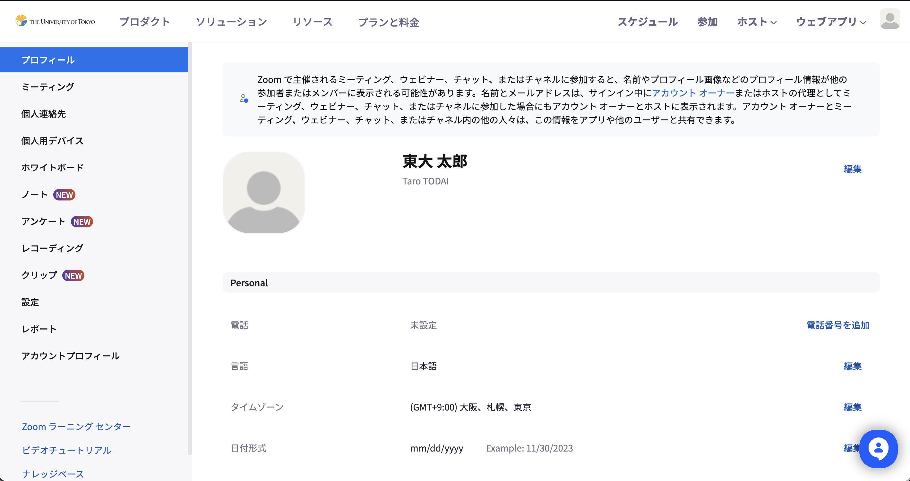
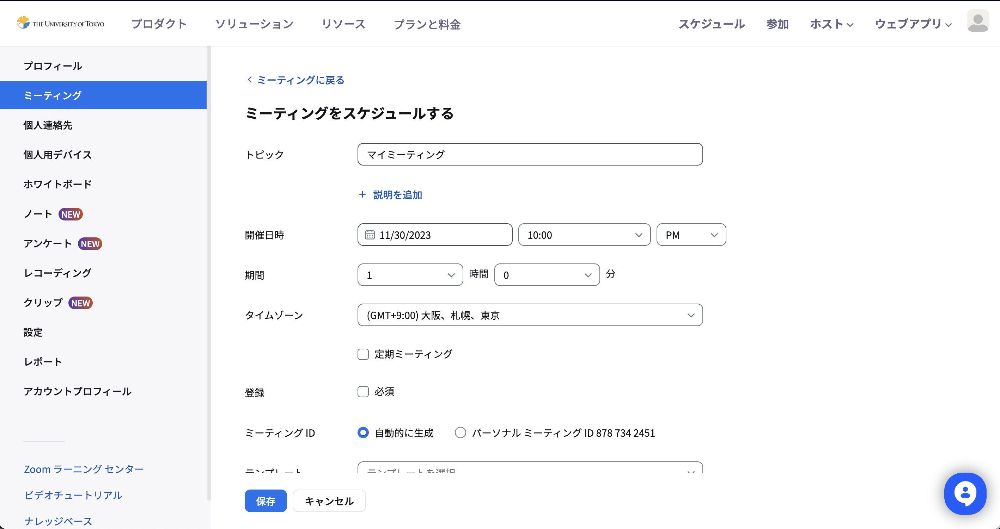
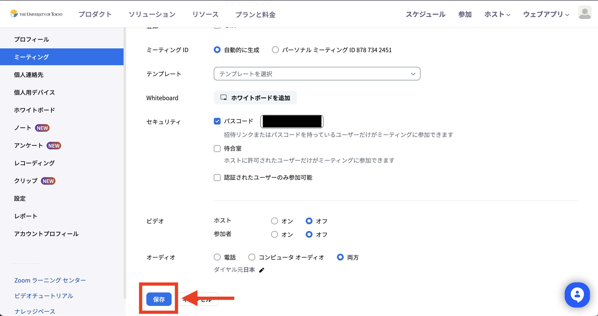
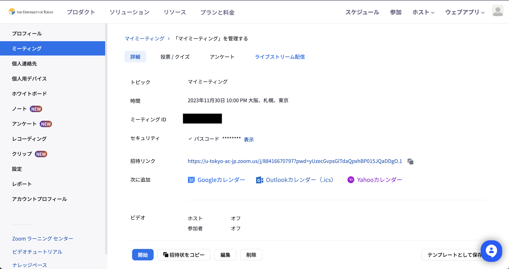
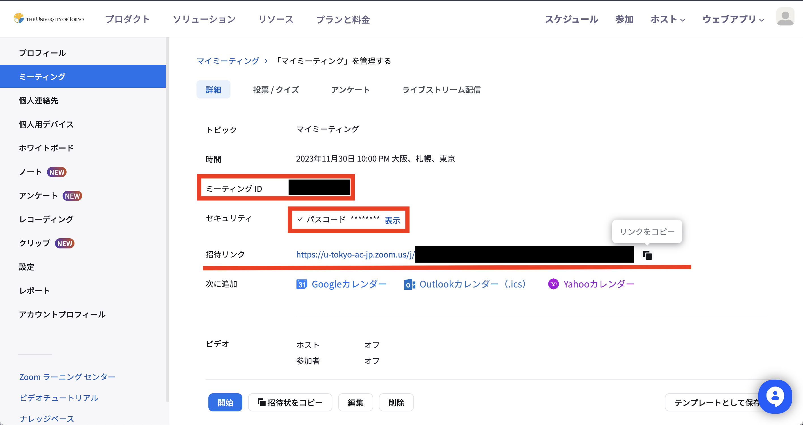
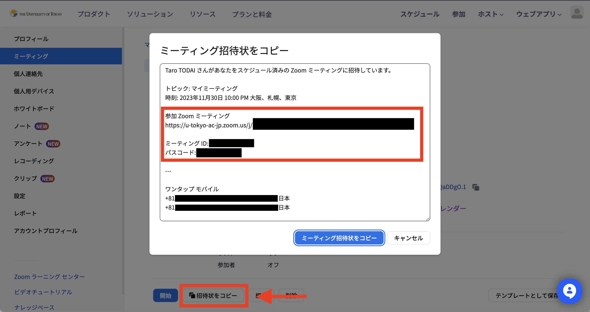
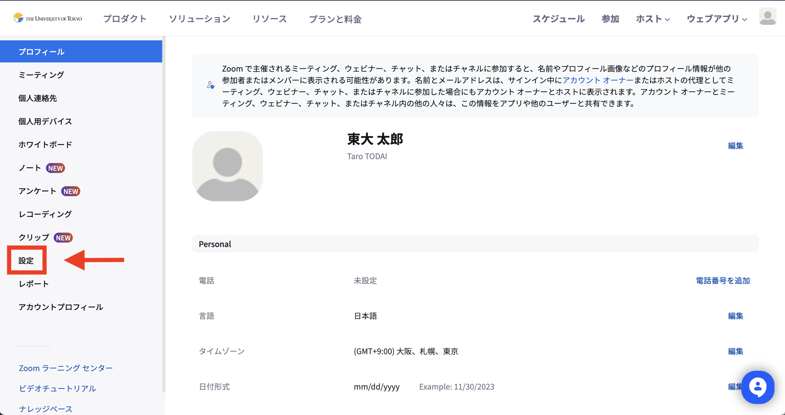
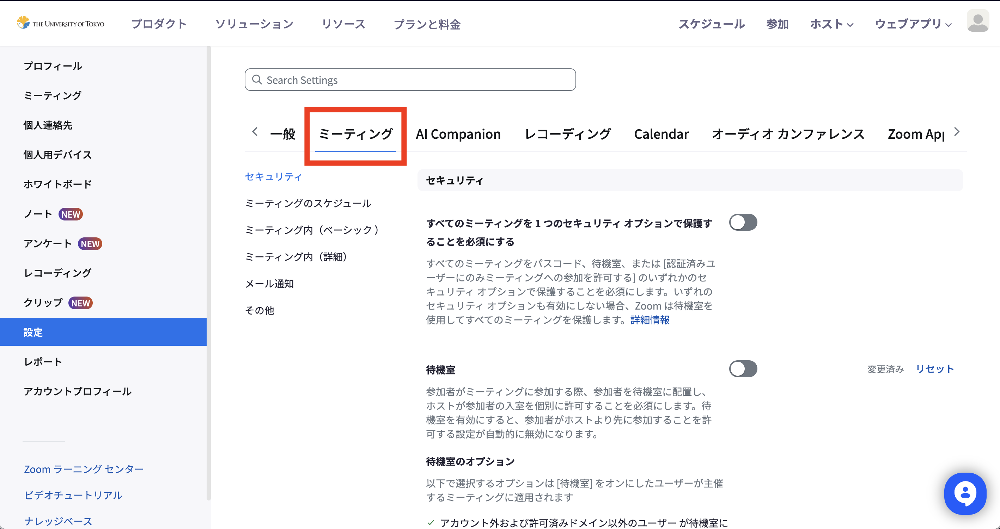

## はじめに
{:#introduction}
このページでは，WebブラウザでのZoomミーティングの作成手順，作成時の設定項目の概要について説明します．  
なお，アプリでのZoomミーティングの作成方法については[Zoomのアプリについて](/zoom/misc/app)のページで説明しています．あわせてお読みください．

## Zoom ミーティングの作成手順
{:#steps-to-create}
ここでは，Webブラウザを用いてZoomミーティングを作成し，作成したミーティングへ参加するための情報を参加予定者に知らせる手順について紹介します．

1. Webブラウザで[Zoomのマイプロフィール](https://u-tokyo-ac-jp.zoom.us/profile)へアクセスしてください．
{:.border}
1. マイプロフィールのヘッダーにある「スケジュール」を選択してください．
{:.border}
1. 表示された画面で，必要な項目を設定してください．個々の設定項目に関する詳しい説明については，下の「[ミーティングの設定項目](#settings)」のセクションを参照してください．
{:.border}
1. 「保存」ボタンを選択してください．Zoomミーティングが作成されます．
{:.border}
1. 作成されたミーティングの詳細の画面が表示されます．あなたが先ほど設定した通りに作られていることを確認してください．
{:.border}

ミーティングへの参加者は，「招待リンク」または「ミーティングIDとパスコード」を利用して，このZoomミーティングにアクセスします．

「招待リンク」または「ミーティングIDとパスコード」を参加者に知らせる方法には，大きく分けて2通りあります．
* 作成されたミーティングの詳細の画面に表示されている「招待リンク」をコピーして参加者に知らせてください．「招待リンク」に加えて，「ミーティングID」と「パスコード」も知らせておくと便利です．
{:.border}
* 手順5の画面に表示されている「招待状をコピー」のボタンを選択して表示される画面の内容を参加者に知らせてください．特に，招待リンク，ミーティングID，パスコードの3つだけ抜き出して知らせておくと簡単で便利です．
{:.border}{:.border}

## ミーティングの設定項目
{:#settings}
ここでは，ミーティングを作成する際の設定項目について概説します．

### ミーティング全般の設定
{:#settings-general}
#### トピック
{:#settings-topic}
ミーティングの名称を設定してください．

「説明を追加」を押すと，トピックの詳しい説明を入力できます．入力された内容は，トピックとともに参加者向けの情報として表示されることがあります．

### 開催日時についての設定
{:#settings-date_and_time}
詳しくは，「[Zoom 開催日時の詳細な設定](/zoom/create_room/date_and_time/)」も参照してください．

#### 開催日時

開始時刻の目安を設定する欄です．あくまで目安であり，設定した開始時刻より早くミーティングを開始できますし，開始時刻を過ぎると自動的にミーティングが開始するわけではありません．

#### 期間

ミーティングの所要時間の目安を設定する欄です．15分単位でしか設定できませんが，あくまで目安の時間であり，設定した時間を過ぎると自動的にミーティングが終了するわけではありません．

#### タイムゾーン

「どこの地域での開催日時か」を設定する欄です．

#### 定期ミーティング

同じトピックやメンバーで授業や会議などを繰り返し実施する場合，Zoomミーティングをその都度作成するのは手間ですし，参加者も毎回同じURLから参加できると便利です．このような場合，「定期ミーティング」にチェックを入れてください．

### その他さまざまな設定
{:#settings-misc}
#### 登録
{:#settings-registration}
参加者に事前に氏名や連絡先等を添えて参加登録してもらいたいときに，この機能を利用します．大規模なイベントで参加者を把握するときなどに活用できます．詳しくは「[Zoomミーティングで参加者に登録を求める](/zoom/create_room/registration/)」を参照してください．

#### ミーティングID
{:#settings-meetingid}
基本的には，「自動的に生成」を選択したままでかまいません．

「自動的に生成」を選択した場合，新たなミーティングIDが自動的に生成され，作成中のそのミーティングに割り当てられます．一方，「パーソナルミーティングID」を選択した場合，ユーザーごとに固有にあらかじめ付与された番号（「パーソナルミーティングID」）が，ミーティングIDとして用いられます．

#### テンプレート
{:#settings-template}
あらかじめミーティングのテンプレートを作成している場合に，この機能を利用できます．

#### Whiteboard
{:#settings-whiteboard}
ミーティング中に使用できる仮想ホワイトボード機能です．

#### セキュリティ
{:#settings-security}
ZoomのミーティングIDは10桁程度の数字でしかなく，なにもセキュリティを施していない場合，本来ミーティングIDを知らないはずの人が当てずっぽうに数字を入力してミーティングに参加してしまうおそれがあります．セキュリティを高めるために，これらの機能を活用してください．

詳しくは，「[授業におけるZoom会議室の入室制限](https://utelecon.adm.u-tokyo.ac.jp/faculty_members/zoom_access_control)」のページを参考にしてください．タイトルには「授業における」とあり，特に授業に用いる場合を想定しておすすめの設定を紹介する記事ですが，一般的な会議等にも応用可能な内容です．

* 「パスコード」
  * オンにすると，ミーティングへの参加時に，ミーティングIDに加えてパスコードの入力が必要となります．パスコードとミーティングIDの両方をを当てずっぽうで探り当てることは非常に難しいため，無関係な第三者がミーティングに参加してしまう危険性が格段に下がります．デフォルトではオンになっていますので，特段の理由がない限りそのままオンにしてください．自分で好きな文字列をパスコードに指定することも，自動生成された文字列を使用することもできます．
  * デフォルトの設定において，ミーティングへの招待リンクにはミーティングIDの情報とパスコードの情報の両方が含まれています．このため，パスコード機能をオンにしても，参加者に招待リンクさえ知らせれば，別途パスコードを知らせる手間はかかりません．ただし，招待リンクに加えてミーティングIDとパスコードを知らせておくことが有効な場合もあります（詳しくは[授業URLの連絡方法についてのお知らせ](/faculty_members/url#use-online-class-info-in-general)もご覧ください）．もし，招待リンクにパスコードの情報を埋め込みたくない場合，設定ページから変更できます．詳しくは，下の「[よく使われている機能の設定方法](#popular_functions)」のセクションを参照してください．
* 「待合室（待機室）」
  * オンにすると，ホストが個別に参加を許可するまで，参加者はミーティングに参加できず，待合室にとどめ置かれます．ホストが許可した人のみミーティングに参加させたい，という場合に利用する機能です．
  * 詳しくは「[Zoomミーティングで待機室を有効にする](/zoom/create_room/waiting_room/)」を参照してください．
* 「認証されたユーザーのみ参加可能」
  * どんなアカウントでZoomにサインインしているかによって，ミーティングへの参加可否を制御する機能です．
  * オンにした上で「大学アカウントでサインイン」を選択すると，UTokyo AccountでZoomにサインインしているユーザのみが，ミーティングに参加できます．
  * オンにした上で「Zoomにサインイン」を選択すると，アカウントの種類によらず，Zoomにサインインしているユーザのみが，ミーティングに参加できます．
  * 詳しくは「[Zoomミーティングで参加時に認証を求める](/zoom/create_room/auth/)」を参照してください．

#### ビデオ
{:#settings-video}
入室時にビデオをつけて参加するか否かについての設定です．あくまでも入室直後の状態についての設定であり，ミーティングの途中でオン・オフを切り替える操作には影響しません．

#### オーディオ
{:#settings-audio}
参加者がミーティング中に利用できるオーディオの種類についての設定項目です．Zoomにはインターネットにつながっていなくても電話から音声だけ参加する方法があるのですが，「コンピュータ オーディオ」を選択すると，この方法は利用できなくなります．基本的には「両方」を選択したままでかまいません．

#### オプション
{:#settings-options}
* 「参加者に参加を許可する」
  * ホストが入室する前に，参加者が入室することを許可する機能です．ホストがミーティングを開く何分前から入室できるかについては，設定ページから変更できます．詳しくは，下の「[よく使われている機能の設定方法](#popular_functions)」のセクションを参照してください．
* 「Q&A」
  * 参加者からの質問を管理しやすくするための機能です．
* 「入室時に参加者をミュートにする」
  * 参加者をミュート状態で入室させる機能です．あくまで入室時にミュートにするか否かの設定であり，ミーティングへの参加中にオン・オフを切り替える操作には影響しません．
* 「ブレイクアウトルーム事前割り当て」
  * ブレイクアウトルーム機能を使うと，メインの会議室から参加者を複数のブレイクアウトルームに分割することができます．この際の部屋割りをあらかじめ決めておくための機能です．
  * 詳しくは「[Zoomのブレイクアウトルーム機能](/zoom/usage/breakout)」を参照してください．
* 「ミーティングを自動的に記録」
  * ミーティングを開始すると直ちに自動的に録画が開始する機能です．ローカルコンピューター上（自分のPC）に保存するか，クラウド内に保存するかを選べます．ここでオフを選んでも，ミーティング中に手動で録画を開始することはできます．
  * 詳しくは「[Zoomのレコーディング機能](/zoom/usage/recording/)」を参照してください．
* 「特定の地域/国からのユーザーへのエントリを承認またはブロックする」
  * 特定の地域/国からの参加を許可する，もしくは，拒否するための設定です．オンにした場合，地域/国を選択することができ，選択した地域/国について参加を許可するのか，拒否するのかを設定できます．
* 「代替ホスト」
  * ホストに代わってミーティングを開始できるユーザーを「代替ホスト」と呼び，この欄を使って指名できます．
  * ただし，指名できるのは，UTokyo AccountでZoomを利用しているユーザのみです．指名したい相手の10桁の共通ID（UTokyo Accountのユーザ名）の後に東京大学であることを表す記号`@utac.u-tokyo.ac.jp`を付けたもの（例：`0123456789@utac.u-tokyo.ac.jp`）を入力してください．
  * 詳しくは[「Zoom ミーティングの管理とそれに関わる役割（ホスト・共同ホスト・代替ホストなど）について」の「代替ホスト」の項目](/zoom/misc/management_roles/#alt_host)を参照してください．

## よく使われている機能の設定方法
{:#popular_functions}
Zoomのマイプロフィールページのサイドメニューにある「設定」を選択すると「マイ設定」ページが開きます．参加者を別々の部屋に分ける「ブレイクアウトルーム」や自分の画面を他の参加者に見せる「画面共有」の設定は，ミーティング作成時の設定項目には入っておらず，この「マイ設定」という別のページから設定する必要があります．「マイ設定」で行う設定は，自分が作成する全てのミーティングに適用される点に留意してください．

ここでは，「マイ設定」の開き方と，「マイ設定」から設定する機能のうちよく使われている機能を紹介します．

### 「マイ設定」ページの開き方

1. Webブラウザで[Zoomのマイプロフィール](https://u-tokyo-ac-jp.zoom.us/profile)へアクセスしてください．
2. サイドメニューにある「設定」を選択してください．
{:.border}

### よく使われている機能

#### 「ミーティング」タブ
{:#meeting_tab}
これらの機能の設定画面は，「マイ設定」ページ上段のタブの中から「ミーティング」を選択すると表示できます．
{:.border}

* 「ワンクリックで参加できるように招待リンクにパスコードを埋め込む」
  * オンにすると，招待リンクにパスコードが埋め込まれ，わざわざ参加者にパスコードを知らせる必要がなくなります．特段の事情がない限りは，**オンにしたまま**でよいでしょう．
* 「ホストより先に参加することを参加者に許可」
  * 通常であれば，ホストが参加するまでミーティングは開始しません．しかしこの項目をオンにしておくと，ホストがミーティングに入室するよりも前に，参加者がミーティングに参加した状態で待てるようになり，さらにどのタイミングでホスト以外の参加者がミーティングに入室できるようになるかも，詳しく設定できるようになります．**オンにしておく**と便利です．
  * この項目がオフになっている場合でも，各ミーティングを作成する際に，「ホストより先に参加することを許可」することはできます（上の「[参加者に参加を許可する](#allow-entrance)」を参照）が，細かい制御はできません．
* 「ミーティング チャット - 自動保存」
  * オンにした場合，ミーティング終了時にチャットが自動で保存されます．
  * 詳しくは「[Zoomミーティングでチャットを使う](/zoom/usage/chat/)」を参照してください．
* 「共同ホスト」
  * 共同ホストとは，ミーティング中にホストが指名する役割のことで，ミーティング中，ホストとほぼ同じ権限を持ちます．この項目をオンにしておけば，ミーティング中に共同ホストを指名できるため，特段の理由がない限りは，**オンにしたまま**でよいでしょう．
  * 詳しくは「[Zoomのホスト・共同ホストについて](/zoom/misc/management_roles/)」を参照してください．
* 「ミーティング投票 / クイズ」
  * ミーティングの中で参加者全体への質問に対する回答を集める際に，便利な機能です．特段の理由がない限りは，**オンにしたまま**でよいでしょう．
  * 詳しくは「[Zoomの投票機能](/zoom/usage/poll/)」を参照してください．
* 「画面共有」
  * ミーティングの中で，画面上の表示内容をそのまま参加者に共有する機能です．
  * この項目をオンにした場合，さらに詳しく，誰が画面共有をできるのか（ホストのみ可能か，ホスト以外の参加者も可能か），などを設定することもできます．
  * 特段の理由がない限りは，**オンにしたまま**でよいでしょう．
  * 詳しくは「[Zoom 画面共有の使い方](/zoom/usage/screen_sharing/)」を参照してください．
* 「ブレイクアウト ルーム - ミーティング」
  * 「[Zoomのブレイクアウトルーム機能](/zoom/usage/breakout)」でブレイクアウトルームについて説明しているので，参照してください．
* 「自動字幕」
  * オンにした場合，参加者が話した内容が自動的に文字起こしされ，Zoom画面に表示されます．
