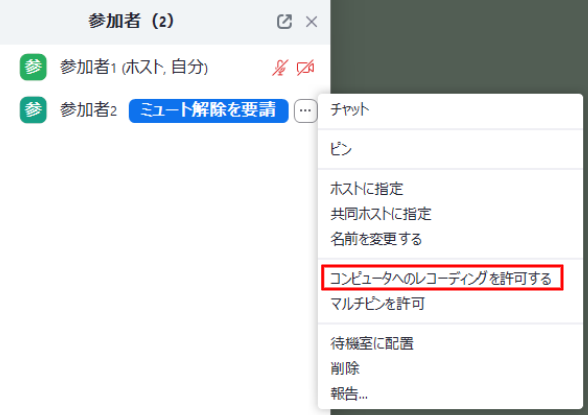
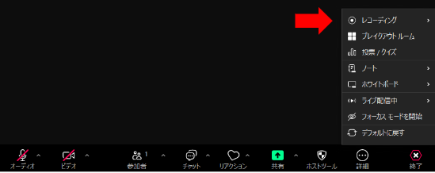
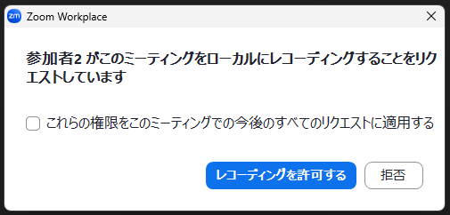
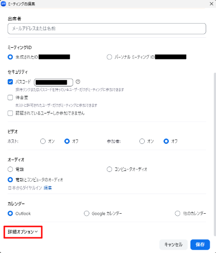
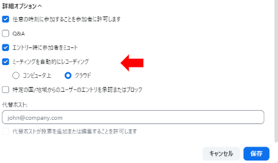
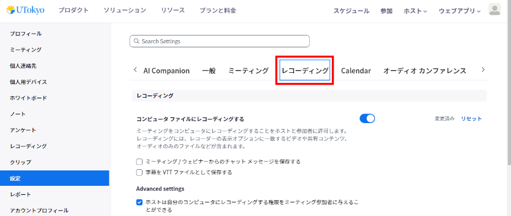
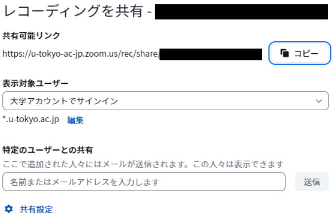
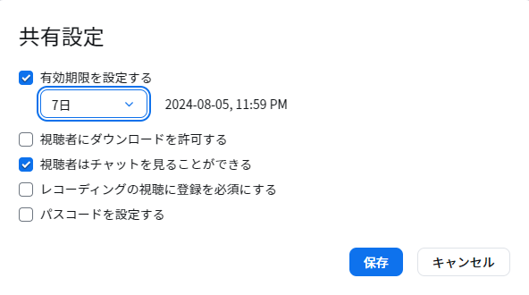
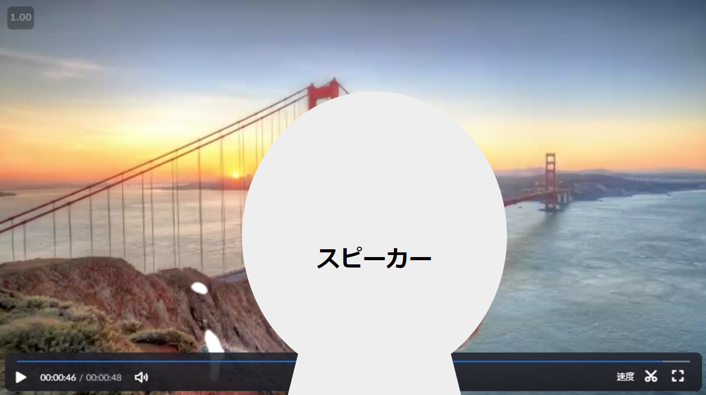

## レコーディング機能の概要

Zoomには，Zoom上で行った講義や会議などの音声と動画（ビデオ映像と画面共有）を録音・録画し保存する，レコーディング機能があります．レコーディングした動画を後から共有することで，その時間に参加できなかった人などにも講義や会議などの内容を確認してもらうことができます．このページではレコーディングの方法，レコーディングした音声や動画の確認・共有方法について説明します．

### ローカルレコーディングとクラウドレコーディング

Zoomのレコーディングには，自分のPCに動画を保存する「ローカルレコーディング」と，Zoomのサーバー上に動画を保存する「クラウドレコーディング」の2つの方法があります．クラウドレコーディングは，有償契約のライセンスのもとでのみ利用可能ですが，東京大学では学生・教職員の皆さんに有償契約のライセンスを提供しているため，UTokyo Accountでサインインした状態で作成した会議室であれば，クラウドレコーディングを利用できます．ローカルレコーディングはPC用のデスクトップアプリからのみ利用可能で，モバイル端末用のアプリやブラウザからは利用できません．

## レコーディングの方法

### レコーディングをする権限

あるミーティングの中でレコーディング機能の操作を実行するためには，そのミーティング内で権限を割り当てられている必要があります．つまり，ミーティングの全ての参加者がそのミーティング内でレコーディング機能を使えるとは限りません．ここでは，「ホスト・共同ホスト」「一般の参加者」「ミーティングを作成したユーザー」に分けて，レコーディングを実行する権限について説明します．
* ホスト・共同ホスト
  * ホスト・共同ホストは，レコーディングを開始・一時停止・停止することができます．
  * ただしローカルレコーディングについては，ホスト・共同ホストは，レコーディングを開始・一時停止・停止する権限を一般の参加者にも付与できます．
    * そのためには，参加者パネルで参加者の名前にカーソルを合わせると出てくる「…」のアイコンを押し，「コンピュータへのレコーディングを許可する」を選択してください．
    {:.border}
* 一般の参加者
  * 一般の参加者（ホスト・共同ホスト以外の参加者）は，ホスト・共同ホストから権限を付与されない限りレコーディングの権限を有しません．
  * レコーディングの権限を有さない参加者は，ホストや共同ホストにレコーディングをリクエストできます．
    * クラウドレコーディングの場合は，ホストや共同ホストにレコーディングを開始してもらいます．
    * ローカルレコーディングの場合は，ホストや共同ホストに許可してもらえば，自らレコーディングすることができます．
  * 参加者が録画したローカルレコーディングは，録画した人のPCに保存されます．
* ミーティングを作成したユーザー
  * ミーティングを作成したユーザーは，ミーティングが開始したら自動的にレコーディングが開始するように，事前に設定できます．
  * クラウドレコーディングにおいて，録画されたレコーディングを管理したり共有設定を変更したりできるのは，ミーティングを作成したユーザー本人だけです．
 
### ミーティング進行中にレコーディングを開始・一時停止・停止する

レコーディングの権限を有する参加者がミーティング中に実際にレコーディングを開始・一時停止・停止する手順を説明します．
1. 進行中のZoom画面の下部にある「レコーディング」というボタンを押してください．
   * ウィンドウが小さい場合などに，「詳細」の中に「レコーディング」がまとめられていることがあるのでご注意ください．
2. 「このコンピュータにレコーディングする」と「クラウドにレコーディングする」という選択肢のうち，使いたい方を押すと，レコーディングが開始します．
   * ローカルレコーディングをしたい場合は前者を，クラウドレコーディングをしたい場合は後者を選択してください．
3. 「レコーディングを一時停止」を押すと，レコーディングを一時停止でき，「レコーディングを再開」を押すと，レコーディングが再開します．
   * 一時停止してから再開した場合，一時停止前と再開後のレコーディングがつながった一つの動画として保存されます．
4. 「レコーディングを停止」というボタンをクリックするか，ミーティングを終了するとレコーディングが終了します．
   * 停止した後で再びレコーディングボタンを押した場合，停止前の動画とレコーディングを再び開始した後の動画は，別々の動画として保存されます．

### レコーディングをリクエストする

レコーディングの権限を有さない参加者は，ホストや共同ホストにレコーディングをリクエストできます．
* レコーディングの権限を有さない参加者が「レコーディング」を押すと，「このコンピュータでレコーディングする権限をリクエストする」「クラウドレコーディングを開始するようにホストにリクエストする」という項目が現れます．
  * 「このコンピュータでレコーディングする権限をリクエストする」を押してリクエストを送信すると，ホストの画面に下の画像のようなダイアログが表示されます．ホストが「レコーディングを許可する」を選択すると，リクエストを送信した参加者にローカルレコーディングの権限が付与されます．
  * クラウドレコーディングが行われていない状態で，「クラウドレコーディングを開始するようにホストにリクエストする」を押してリクエストを送信すると，ホストの画面に下の画像のようなダイアログが表示されます．ホストが「レコーディングを開始」を選択すると，クラウドレコーディングが開始されます．

### レコーディングを自動的に開始する

ミーティングを作成したユーザーは，ミーティングが開始したら自動的にレコーディングが開始するように，事前に設定できます．
この機能を活用すると，レコーディングを開始する手間を省いたり，レコーディングし忘れるのを防いだりできます．必要に応じて活用してください．
Zoomアプリの「ミーティングのスケジューリング」，または「編集」から，以下の手順で設定できます．なお，ミーティングの作成・編集については「[Zoom ミーティングを作成する](/zoom/create_room/)」の記事を参照してください．
1. ミーティングの作成または編集画面下部の，「オプション」または「詳細オプション」という項目を開き，「ミーティングを自動的にレコーディング」にチェックを入れてください．
2. ローカルにレコーディングするかクラウドにレコーディングするかを選択し，「保存」を押してください．
{:.border}
{:.border}
  * なお，Zoomのウェブポータルの「設定」から，「レコーディング」を開き，「自動レコーディング」のトグルを選択して有効にしておくと，ミーティング別に設定を行わなくても，そのユーザーが作成する全てのミーティングで自動的にレコーディングが開始されます．
  {:.border}
  {:.border}

## レコーディングを管理・共有する

レコーディングした動画を確認・管理したり，他の人に共有したりするには，それぞれ次のようにしてください．

### レコーディングを確認する

Zoomのウェブポータルの「レコーディング」から，「クラウド レコーディング」「ローカルレコーディング」を確認すると，それぞれクラウド，ローカルに保存されているレコーディングが一覧になっています．
なお，レコーディングの停止直後は動画の変換などが行われるため，動画が利用可能になるまで時間がかかります．
* ローカルに保存した動画は，レコーディングをした人のPC等の，指定された場所に保存されます．
  * もし保存されている場所が分からない場合は，Zoomのアプリの「設定」から，「レコーディング」を開き，「ローカルレコーディングの保存場所」の横にある「開く」を押すと，PC等の中で動画が保存される場所を確認できます．
* クラウドレコーディングでは，デフォルトの設定では，レコーディングした動画が利用可能になるとメールにてリンク等が送られてきます．
  * メール通知をオフにしたい場合は，Zoomのウェブポータルの「設定」から，「設定」→「メール通知」の「クラウド レコーディングが利用可能なとき」という項目をオフにしてください．

### レコーディングをクラウドストレージにアップロードして共有する

ローカルレコーディングを他の人に共有したい場合，GoogleドライブやOneDriveなどのクラウドストレージにアップロードすると便利です．また，クラウドレコーディングについても，Zoomのクラウドからダウンロードしたうえで，GoogleドライブやOneDrive等にアップロードして共有することができます．
GoogleドライブやOneDriveでの操作方法については，下記の記事を参照してください．
* [Googleドライブでファイルを共有する](/google/drive/share)
* [OneDriveでファイルを共有する](/microsoft/onedrive/share)

### クラウドレコーディングをURLで共有する

クラウドレコーディングについては，共有用のURLを知らせることで，レコーディングを共有することができます．
Zoomのウェブポータルの「レコーディング」から，「クラウド レコーディング」を開き，共有したいレコーディングを押すと，各レコーディングの詳細の画面が表示されます．そこに「共有可能リンクをコピーする」というボタンがあります．これを押して共有用のURLをコピーし，必要な人に知らせてください．
ただし，この共有用URLを知らせただけでは，知らされた相手によってはレコーディングを視聴できない場合があります．これは，限られた人だけがレコーディングを視聴できるようにして，万一URLが流出した際に不特定多数の人が視聴できてしまうことを防ぐ機能があるからです．この機能を活用し，URLからレコーディングを視聴できる人を制限する設定を変更するには，次のようにしてください．
* 各レコーディングの詳細の画面（上の画像）で，「共有」ボタンを押すと，「レコーディングを共有」という画面が表示されます．この画面で，「表示対象ユーザー」「特定のユーザーとの共有」の各項目を必要に応じて設定してください．
* 「表示対象ユーザー」欄を適切に設定することで，レコーディングの視聴を許す相手を包括的に指定できます．その選択肢として，「レコーディング リンクのある全ユーザー」と「大学アカウントでサインイン」があります．
  * 「レコーディング リンクのある全ユーザー」を選択すると，URLを知っている全ての人がレコーディングを視聴できるようになります．
  * 「大学アカウントでサインイン」を選択すると，UTokyo Accountでサインインしている人だけがレコーディングを視聴できるようになります．**デフォルトではこの設定になっています**．
  * 「以下であなたが共有した人々のみ」「該当者なし」を選択した場合は，包括的な指定はしないことになります．
* 「特定のユーザーとの共有」欄を適切に設定することで，レコーディングの視聴を許す相手を個別に指定できます．
  * 共有したい相手のメールアドレスを「特定のユーザーとの共有」欄に入力して「送信」を押すと，そのメールアドレス宛に視聴のためのリンクが届き，その相手は共有された動画を視聴できます．なおこの際，共有された相手がそのメールアドレスでZoomにサインアップしておく必要はありません．
* 包括的な指定と個別の指定は併用することもできます．
  * 例えば，「大学アカウントでサインイン」を選んだうえで「特定のユーザーとの共有」で学外の人を指定した場合，UTokyo Accountでサインインしている人に加え，指定した学外の人もレコーディングを視聴できるようになります．
  * 個別に指定した人のみに制限したい場合は，「表示対象ユーザー」欄で「以下であなたが共有した人々のみ」を選択したうえで，「表示対象ユーザー」欄で特定の人を指定してください．
* さらに，「レコーディングを共有」の画面（上の画像）下部の「共有設定」を押すと，以下の項目について設定することができます．
  * 「有効期限を設定する」にチェックを入れて日数を選択することで，共有された相手がレコーディングを視聴できる期限を設定できます．
  * 「視聴者にダウンロードを許可する」にチェックを入れると，共有した相手はブラウザ上だけでなく，動画をダウンロードして視聴できるようになります．
  * 「視聴者はチャットを見ることができる」にチェックを入れると，共有した相手は会議中に行われたチャットの履歴を見ることができます．
  * 「レコーディングの視聴に登録を必須にする」にチェックを入れると，共有された相手はレコーディングを視聴する際に自分の名前とメールアドレスを登録することを求められるようになります．
  * 「パスコードを設定する」にチェックを入れてパスコードを設定すると，共有された相手は，共有用URLにアクセスするだけではレコーディングを視聴できず，設定されたパスコードの入力を求められるようになります．

また，「レコーディングを確認する」で紹介したメール通知からも，共有用URLのコピーや共有設定を行うことができます．

## クラウドレコーディングを削除する

クラウドに保存した動画は，以下の手順で削除することができます．
1. Zoomのウェブポータルの「レコーディング」から，「クラウド レコーディング」を開いてください．
2. 削除したいレコーディングの行の右側にある「・・・」をクリックし，「削除」を選択してください．
3. 複数のレコーディングをまとめて削除したい場合は，画像左側にある四角いチェックボックスにチェックを入れ，「選択したものを削除する」ボタンを押してください．
4. 「クラウド レコーディングをゴミ箱に移動」という確認画面が表示されるので，「ゴミ箱に移動」ボタンを押して下さい．なお，削除の操作を実行した後しばらくは録画一覧画面に「削除中…」と表示されますが，しばらくすると消えますので無視してかまいません．

また，ある1回のミーティングの録画の中で一部のファイルのみを削除することもできます．例えば，スピーカービューと共有画面を別々に録画している場合に，スピーカービューの録画のみを削除するような操作が可能です．
1. Zoomのウェブポータルの「レコーディング」から，「クラウド レコーディング」を開いてください．
2. レコーディングの一覧から，削除対象のファイルが含まれる録画を探し，ミーティングトピックを選択して詳細画面に移動してください．
3. 録画の詳細画面で削除対象のファイルにマウスポインタをかざし，ごみ箱のアイコンを選択してください．
4. 「このファイルをゴミ箱に移動」と書かれた確認画面が表示されるので，「ゴミ箱に移動」ボタンを押してください．

さらに，一定期間が経過すると自動でクラウドレコーディングが削除されるように設定することもできます．
1. Zoomのウェブポータルの「設定」から，「レコーディング」を開いてください．
2. 「指定された日数が経過した後、クラウド レコーディングを削除します」という項目で，トグルを選択して有効にしてください．
3. 録画後何日で自動的に削除するかを設定する欄が表示されるので，適当な日数を入力して「保存」を押してください．

Zoomのクラウドに保存できるクラウドレコーディングの容量には限りがあり，東京大学が契約しているZoomライセンスにも大きな費用がかかってしまっています．そのため，必要のないクラウドレコーディングの削除にご協力お願いします．詳しくは，「[Zoomクラウド録画における不要なデータ削除等のお願い](/notice/2023/12-zoom-cloud-recording/)」のページもご確認ください．

## レコーディングのレイアウト

Zoomのレコーディングでは，ミーティング中の共有画面や，発言中の参加者を大きく表示するスピーカービューを，動画の中でどのように配置するかといったレイアウトを設定できます．

使用できるレイアウトは，レコーディング方法によって異なります．レコーディングのレイアウトについては，「[Zoomレコーディングのレイアウト](/zoom/recording_layout/)」で詳しく説明していますので，本記事では最小限の説明に留めます．また，「スピーカービュー」や「ギャラリービュー」の違いについては，「[Zoom ミーティング画面のレイアウト](/zoom/usage/layout/)」も参考にしてください．

### ローカルレコーディングのレイアウト

ローカルレコーディングでは，レコーディングをしている参加者のPC等に表示されているZoomの画面が，そのままのレイアウトで録画されます．ただし，レコーディングをしている参加者が画面共有を行っている場合は，共有画面をZoomで見ているときのレイアウトで録画されます．

### クラウドレコーディングのレイアウト

クラウドレコーディングでは，ミーティング時に各参加者のPCやスマホ等に表示されている画面とは関係なく，ミーティングを作成したユーザーが事前に設定したレイアウトでレコーディングをできます．
レイアウトを設定する手順は以下の通りです．
1. ウェブポータルの「設定」から「レコーディング」を開いてください．
2. 「クラウドレコーディング」の項目で，「共有画面でアクティブスピーカーをレコーディングする」「共有画面でギャラリービューをレコーディングする」「アクティブスピーカー，ギャラリービュー，共有画面を別々にレコーディングする」の中から，レコーディングしたいレイアウトを選択してください．この際，複数のレイアウトを選択すると，それぞれのレイアウトで別々の動画としてレコーディングされます．
{:.border}
{:.border}
* 共有画面でアクティブスピーカーをレコーディングする
  * 画面共有中のコンテンツとアクティブスピーカービューの両方が，一つの動画としてレコーディングされます．
  {:.border}
* 共有画面でギャラリービューをレコーディングする
  * 画面共有中のコンテンツとギャラリービューの両方が，一つの動画としてレコーディングされます．
  {:.border}
  * ただし，画面共有中は「共有画面でアクティブスピーカーをレコーディングする」同様，右上にアクティブスピーカービューが配置される形でレコーディングされます．
* アクティブ スピーカー、ギャラリー ビュー、共有画面を別々にレコーディングする
  * アクティブスピーカー，ギャラリービュー，画面共有中のコンテンツが別々の動画としてレコーディングされます．
  * 「アクティブ スピーカー、ギャラリー ビュー、共有画面を別々にレコーディングする」をチェックにしたうえで，「アクティブスピーカー」，「ギャラリービュー」，「共有画面」の中から保存したい項目にチェックを入れてください．

※選択肢の「共有画面で」の箇所は，「共有画面と」と訳すべき“with”の誤訳と思われます．
